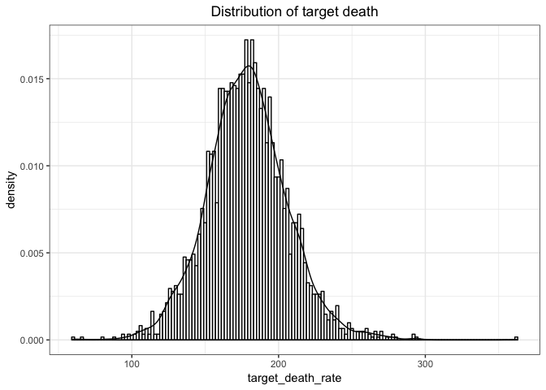
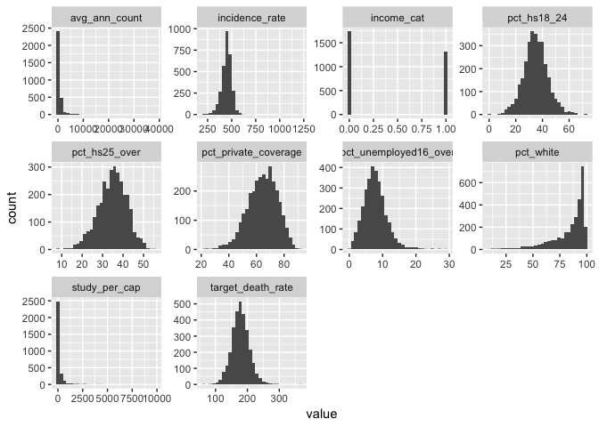
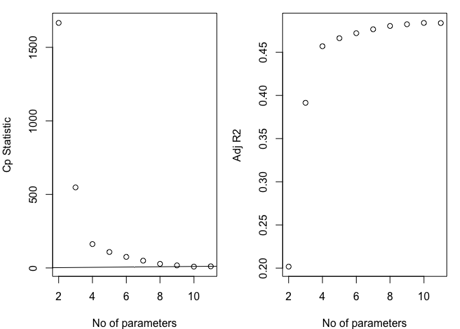
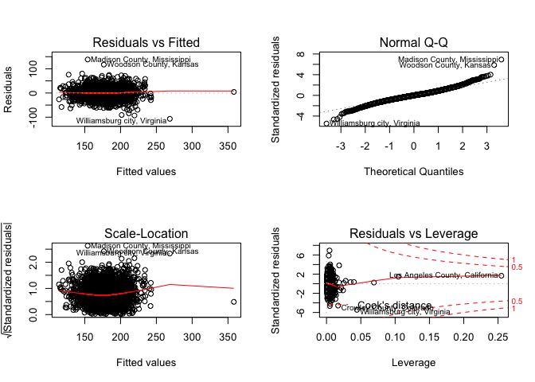
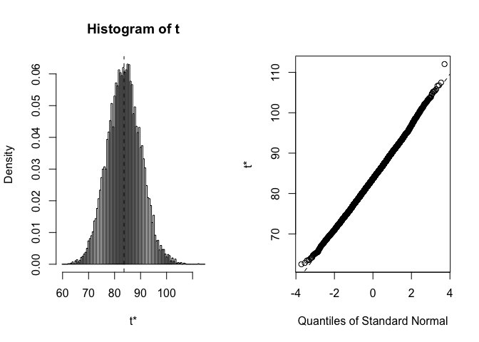
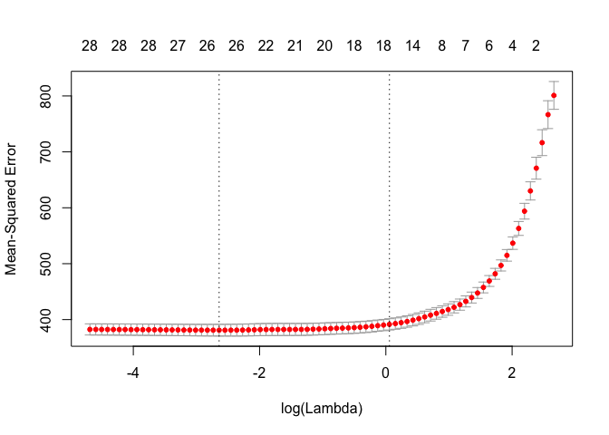
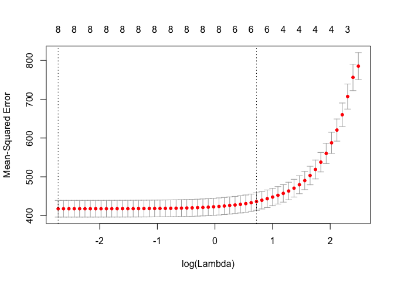
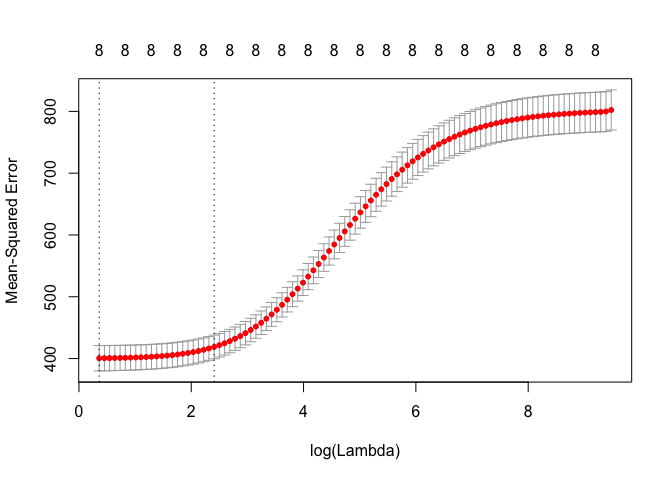
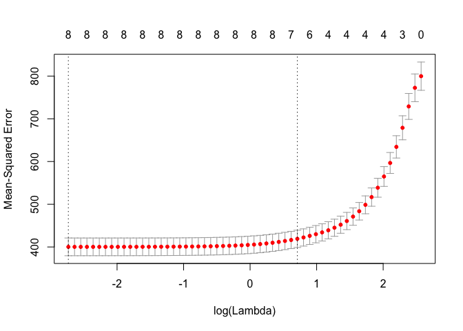
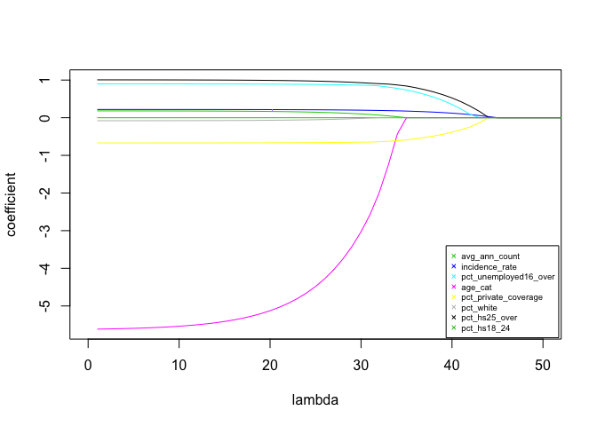

p8130\_final\_project
================
Qinyao Wu
12/6/2018

``` r
#Import data
cancer_data = read_csv("./data/Cancer_Registry.csv") 
```

    ## Parsed with column specification:
    ## cols(
    ##   .default = col_double(),
    ##   avgDeathsPerYear = col_integer(),
    ##   medIncome = col_integer(),
    ##   popEst2015 = col_integer(),
    ##   binnedInc = col_character(),
    ##   Geography = col_character()
    ## )

    ## See spec(...) for full column specifications.

``` r
#Count na, modify the na table to show the variable with NAs. 
cancer_na = map_df(cancer_data, function(x) sum(is.na(x))) %>% data.frame() %>%
  t() %>% data.frame()

#Add column names.
colnames(cancer_na) = "na_counts"

#Make a table for na. 
cancer_na = cancer_na %>% mutate(variable_name = row.names(cancer_na)) %>% dplyr::select(2, 1) %>%
  filter(na_counts > 0) %>% knitr::kable()
cancer_na
```

| variable\_name          |  na\_counts|
|:------------------------|-----------:|
| PctSomeCol18\_24        |        2285|
| PctEmployed16\_Over     |         152|
| PctPrivateCoverageAlone |         609|

``` r
#Tidy the data set. 
cancer_data_analysis = cancer_data %>% 
  janitor::clean_names() %>% 

  #Make income a dummy variable by divide up by mean of income. 
  mutate(med_income = as.numeric(med_income) ) %>% 
  mutate(income_cat = ifelse(med_income >= mean(med_income), 1, 0)) %>% 
  
  #Divide up ages by mean of age. 
  mutate(age_cat = ifelse(median_age >= mean(median_age), 1, 0)) %>%
  
  #remove variables with a lot of na, pct_employed16_over do not have a lot, so we decide to keep it. 
  dplyr::select(-pct_some_col18_24, -pct_private_coverage_alone, -med_income) %>% 
  
  #remove unrelated variables
  dplyr::select(-binned_inc, -pct_employed16_over) %>% 
 
  #Make the y at the first column. 
  dplyr::select(target_death_rate, everything())
  
 #Skim over all the variables.  
cancer_data_analysis %>% 
  dplyr::select(-geography) %>% 

 skimr::skim()
```

    ## Skim summary statistics
    ##  n obs: 3047 
    ##  n variables: 30 
    ## 
    ## ── Variable type:integer ────────────────────────────────────────────────────────────────────────────────────
    ##             variable missing complete    n     mean        sd  p0   p25
    ##  avg_deaths_per_year       0     3047 3047   185.97    504.13   3    28
    ##          pop_est2015       0     3047 3047 1e+05    329059.22 827 11684
    ##    p50   p75  p100     hist
    ##     61   149 14010 ▇▁▁▁▁▁▁▁
    ##  26643 68671 1e+07 ▇▁▁▁▁▁▁▁
    ## 
    ## ── Variable type:numeric ────────────────────────────────────────────────────────────────────────────────────
    ##                   variable missing complete    n   mean      sd      p0
    ##                    age_cat       0     3047 3047   0.18    0.39   0    
    ##              avg_ann_count       0     3047 3047 606.34 1416.36   6    
    ##         avg_household_size       0     3047 3047   2.48    0.43   0.022
    ##                 birth_rate       0     3047 3047   5.64    1.99   0    
    ##             incidence_rate       0     3047 3047 448.27   54.56 201.3  
    ##                 income_cat       0     3047 3047   0.43    0.5    0    
    ##                 median_age       0     3047 3047  45.27   45.3   22.3  
    ##          median_age_female       0     3047 3047  42.15    5.29  22.3  
    ##            median_age_male       0     3047 3047  39.57    5.23  22.4  
    ##                  pct_asian       0     3047 3047   1.25    2.61   0    
    ##          pct_bach_deg18_24       0     3047 3047   6.16    4.53   0    
    ##        pct_bach_deg25_over       0     3047 3047  13.28    5.39   2.5  
    ##                  pct_black       0     3047 3047   9.11   14.53   0    
    ##      pct_emp_priv_coverage       0     3047 3047  41.2     9.45  13.5  
    ##                pct_hs18_24       0     3047 3047  35       9.07   0    
    ##              pct_hs25_over       0     3047 3047  34.8     7.03   7.5  
    ##     pct_married_households       0     3047 3047  51.24    6.57  22.99 
    ##             pct_no_hs18_24       0     3047 3047  18.22    8.09   0    
    ##             pct_other_race       0     3047 3047   1.98    3.52   0    
    ##       pct_private_coverage       0     3047 3047  64.35   10.65  22.3  
    ##        pct_public_coverage       0     3047 3047  36.25    7.84  11.2  
    ##  pct_public_coverage_alone       0     3047 3047  19.24    6.11   2.6  
    ##      pct_unemployed16_over       0     3047 3047   7.85    3.45   0.4  
    ##                  pct_white       0     3047 3047  83.65   16.38  10.2  
    ##            percent_married       0     3047 3047  51.77    6.9   23.1  
    ##            poverty_percent       0     3047 3047  16.88    6.41   3.2  
    ##              study_per_cap       0     3047 3047 155.4   529.63   0    
    ##          target_death_rate       0     3047 3047 178.66   27.75  59.7  
    ##     p25    p50    p75     p100     hist
    ##    0      0      0        1    ▇▁▁▁▁▁▁▂
    ##   76    171    518    38150    ▇▁▁▁▁▁▁▁
    ##    2.37   2.5    2.63     3.97 ▁▁▁▁▇▇▁▁
    ##    4.52   5.38   6.49    21.33 ▁▇▇▂▁▁▁▁
    ##  420.3  453.55 480.85  1206.9  ▁▇▇▁▁▁▁▁
    ##    0      0      1        1    ▇▁▁▁▁▁▁▆
    ##   37.7   41     44      624    ▇▁▁▁▁▁▁▁
    ##   39.1   42.4   45.3     65.7  ▁▁▃▇▅▁▁▁
    ##   36.35  39.6   42.5     64.7  ▁▂▆▇▃▁▁▁
    ##    0.25   0.55   1.22    42.62 ▇▁▁▁▁▁▁▁
    ##    3.1    5.4    8.2     51.8  ▇▅▁▁▁▁▁▁
    ##    9.4   12.3   16.1     42.2  ▂▇▆▃▁▁▁▁
    ##    0.62   2.25  10.51    85.95 ▇▁▁▁▁▁▁▁
    ##   34.5   41.1   47.7     70.7  ▁▂▆▇▇▅▁▁
    ##   29.2   34.7   40.7     72.5  ▁▁▃▇▆▂▁▁
    ##   30.4   35.3   39.65    54.8  ▁▁▂▅▇▆▂▁
    ##   47.76  51.67  55.4     78.08 ▁▁▂▆▇▂▁▁
    ##   12.8   17.1   22.7     64.1  ▂▇▇▃▁▁▁▁
    ##    0.3    0.83   2.18    41.93 ▇▁▁▁▁▁▁▁
    ##   57.2   65.1   72.1     92.3  ▁▁▂▅▇▇▅▁
    ##   30.9   36.3   41.55    65.1  ▁▂▅▇▇▃▁▁
    ##   14.85  18.8   23.1     46.6  ▁▃▇▇▃▁▁▁
    ##    5.5    7.6    9.7     29.4  ▂▇▇▂▁▁▁▁
    ##   77.3   90.06  95.45   100    ▁▁▁▁▁▂▃▇
    ##   47.75  52.4   56.4     72.5  ▁▁▁▅▇▇▂▁
    ##   12.15  15.9   20.4     47.4  ▂▇▇▅▂▁▁▁
    ##    0      0     83.65  9762.31 ▇▁▁▁▁▁▁▁
    ##  161.2  178.1  195.2    362.8  ▁▁▆▇▂▁▁▁

``` r
#Look at the overall correlation. 
cancer_data_analysis %>% 
  dplyr::select(-geography) %>% 
  cor() %>% 
  knitr::kable()
```

|                              |  target\_death\_rate|  avg\_ann\_count|  avg\_deaths\_per\_year|  incidence\_rate|  pop\_est2015|  poverty\_percent|  study\_per\_cap|  median\_age|  median\_age\_male|  median\_age\_female|  avg\_household\_size|  percent\_married|  pct\_no\_hs18\_24|  pct\_hs18\_24|  pct\_bach\_deg18\_24|  pct\_hs25\_over|  pct\_bach\_deg25\_over|  pct\_unemployed16\_over|  pct\_private\_coverage|  pct\_emp\_priv\_coverage|  pct\_public\_coverage|  pct\_public\_coverage\_alone|  pct\_white|  pct\_black|  pct\_asian|  pct\_other\_race|  pct\_married\_households|  birth\_rate|  income\_cat|    age\_cat|
|------------------------------|--------------------:|----------------:|-----------------------:|----------------:|-------------:|-----------------:|----------------:|------------:|------------------:|--------------------:|---------------------:|-----------------:|------------------:|--------------:|---------------------:|----------------:|-----------------------:|------------------------:|-----------------------:|-------------------------:|----------------------:|-----------------------------:|-----------:|-----------:|-----------:|-----------------:|-------------------------:|------------:|------------:|-----------:|
| target\_death\_rate          |            1.0000000|       -0.1435316|              -0.0907152|        0.4494317|    -0.1200731|         0.4293890|       -0.0222850|    0.0043751|         -0.0219294|            0.0120484|            -0.0369053|        -0.2668205|          0.0884626|      0.2619759|            -0.2878174|        0.4045891|              -0.4854773|                0.3784124|              -0.3860655|                -0.2673994|              0.4045717|                     0.4493576|  -0.1774000|   0.2570236|  -0.1863311|        -0.1898936|                -0.2933253|   -0.0874070|   -0.3682438|  -0.1112003|
| avg\_ann\_count              |           -0.1435316|        1.0000000|               0.9394078|        0.0735532|     0.9268935|        -0.1356939|        0.0820714|   -0.0240975|         -0.1249686|           -0.1228441|             0.0647878|        -0.1061077|         -0.1433269|     -0.1820539|             0.2841762|       -0.3113752|               0.3210206|               -0.0090158|               0.1322444|                 0.2023489|             -0.1735483|                    -0.0936991|  -0.1365011|   0.0313756|   0.4350712|         0.2091838|                -0.1062209|   -0.0345076|    0.2192454|  -0.0743736|
| avg\_deaths\_per\_year       |           -0.0907152|        0.9394078|               1.0000000|        0.0626899|     0.9776341|        -0.0669179|        0.0634883|   -0.0245987|         -0.1484872|           -0.1440692|             0.0861615|        -0.1810291|         -0.1367942|     -0.1514178|             0.2597608|       -0.2959294|               0.2932098|                0.0697006|               0.0561826|                 0.1601237|             -0.1316865|                    -0.0273380|  -0.1871590|   0.0846071|   0.4430742|         0.2151494|                -0.1602661|   -0.0744200|    0.1669993|  -0.0939190|
| incidence\_rate              |            0.4494317|        0.0735532|               0.0626899|        1.0000000|     0.0269124|         0.0090463|        0.0772826|    0.0180892|         -0.0147332|           -0.0091056|            -0.1184000|        -0.1195245|         -0.1707621|      0.0226438|             0.0468354|        0.1217246|              -0.0381772|                0.0999795|               0.1051743|                 0.1498245|              0.0461086|                     0.0408123|  -0.0145098|   0.1134890|  -0.0081234|        -0.2087483|                -0.1521763|   -0.1181813|    0.0080758|  -0.0780863|
| pop\_est2015                 |           -0.1200731|        0.9268935|               0.9776341|        0.0269124|     1.0000000|        -0.0652991|        0.0557215|   -0.0252190|         -0.1766076|           -0.1779323|             0.1099404|        -0.1604633|         -0.1265824|     -0.1518212|             0.2483754|       -0.3118492|               0.2974634|                0.0507681|               0.0526765|                 0.1586495|             -0.1600656|                    -0.0414688|  -0.1900945|   0.0730441|   0.4641678|         0.2414680|                -0.1279795|   -0.0577402|    0.1763925|  -0.1000458|
| poverty\_percent             |            0.4293890|       -0.1356939|              -0.0669179|        0.0090463|    -0.0652991|         1.0000000|       -0.0556524|   -0.0292800|         -0.2140010|           -0.1481635|             0.0743076|        -0.6428569|          0.2881064|      0.0942111|            -0.3871219|        0.1943612|              -0.5315997|                0.6551481|              -0.8225343|                -0.6830997|              0.6511621|                     0.7986420|  -0.5094328|   0.5115297|  -0.1572887|         0.0470959|                -0.6049528|   -0.0122825|   -0.6679347|  -0.1051837|
| study\_per\_cap              |           -0.0222850|        0.0820714|               0.0634883|        0.0772826|     0.0557215|        -0.0556524|        1.0000000|   -0.0260298|         -0.0366473|           -0.0305770|            -0.0040709|        -0.0381433|         -0.0903873|     -0.0570351|             0.0638191|       -0.0851280|               0.1085938|               -0.0319568|               0.0925447|                 0.1000632|             -0.0514967|                    -0.0555120|   0.0232910|  -0.0197612|   0.0625431|        -0.0152475|                -0.0517356|    0.0106762|    0.0619825|  -0.0249803|
| median\_age                  |            0.0043751|       -0.0240975|              -0.0245987|        0.0180892|    -0.0252190|        -0.0292800|       -0.0260298|    1.0000000|          0.1291195|            0.1246784|            -0.0319441|         0.0463715|          0.0061781|      0.0505737|            -0.0169094|        0.0365874|              -0.0203522|                0.0185904|               0.0046651|                -0.0369265|              0.0490602|                    -0.0032979|   0.0350094|  -0.0171732|  -0.0384239|        -0.0302765|                 0.0145036|   -0.0082762|   -0.0130243|   0.2824866|
| median\_age\_male            |           -0.0219294|       -0.1249686|              -0.1484872|       -0.0147332|    -0.1766076|        -0.2140010|       -0.0366473|    0.1291195|          1.0000000|            0.9336961|            -0.3431887|         0.4499862|          0.1004855|      0.2413099|            -0.0341352|        0.3182771|              -0.1315994|               -0.1427375|               0.0822318|                -0.2086640|              0.3989672|                     0.0024787|   0.3980444|  -0.2427481|  -0.2383224|        -0.2666554|                 0.2222777|   -0.1041052|   -0.0768562|   0.6672081|
| median\_age\_female          |            0.0120484|       -0.1228441|              -0.1440692|       -0.0091056|    -0.1779323|        -0.1481635|       -0.0305770|    0.1246784|          0.9336961|            1.0000000|            -0.3675851|         0.3752080|          0.1363613|      0.2428273|            -0.0706990|        0.3448397|              -0.1808453|               -0.1111613|               0.0469092|                -0.2522211|              0.4554965|                     0.0476591|   0.3398039|  -0.1567284|  -0.2587479|        -0.2741196|                 0.1615068|   -0.0988126|   -0.1265069|   0.6290699|
| avg\_household\_size         |           -0.0369053|        0.0647878|               0.0861615|       -0.1184000|     0.1099404|         0.0743076|       -0.0040709|   -0.0319441|         -0.3431887|           -0.3675851|             1.0000000|        -0.1005117|          0.0647186|      0.0272282|            -0.0609608|       -0.1387284|               0.0139178|                0.1315063|              -0.1443906|                 0.0111112|             -0.1348122|                     0.0611147|  -0.1884458|   0.0302780|   0.1315354|         0.2294396|                 0.0914504|    0.0759176|    0.0635961|  -0.2154383|
| percent\_married             |           -0.2668205|       -0.1061077|              -0.1810291|       -0.1195245|    -0.1604633|        -0.6428569|       -0.0381433|    0.0463715|          0.4499862|            0.3752080|            -0.1005117|         1.0000000|         -0.0123746|      0.1327924|             0.0530373|        0.1024337|               0.1035852|               -0.5514835|               0.4494516|                 0.2328991|             -0.2469715|                    -0.4599899|   0.6774199|  -0.6223573|  -0.1486913|        -0.1046694|                 0.8702605|    0.1414039|    0.3050008|   0.2715222|
| pct\_no\_hs18\_24            |            0.0884626|       -0.1433269|              -0.1367942|       -0.1707621|    -0.1265824|         0.2881064|       -0.0903873|    0.0061781|          0.1004855|            0.1363613|             0.0647186|        -0.0123746|          1.0000000|      0.0846293|            -0.3814220|        0.2170695|              -0.3965786|                0.1811932|              -0.4547508|                -0.4299940|              0.3185403|                     0.3272698|  -0.1572823|   0.1168052|  -0.2175346|         0.1262564|                 0.0053396|    0.1258948|   -0.2357460|   0.0369420|
| pct\_hs18\_24                |            0.2619759|       -0.1820539|              -0.1514178|        0.0226438|    -0.1518212|         0.0942111|       -0.0570351|    0.0505737|          0.2413099|            0.2428273|             0.0272282|         0.1327924|          0.0846293|      1.0000000|            -0.3893339|        0.4389291|              -0.4047540|                0.1306941|              -0.2538507|                -0.2444941|              0.2782205|                     0.2341240|   0.0453064|  -0.0248679|  -0.1997705|        -0.0604148|                 0.1200402|    0.0582269|   -0.1565607|   0.1085555|
| pct\_bach\_deg18\_24         |           -0.2878174|        0.2841762|               0.2597608|        0.0468354|     0.2483754|        -0.3871219|        0.0638191|   -0.0169094|         -0.0341352|           -0.0706990|            -0.0609608|         0.0530373|         -0.3814220|     -0.3893339|             1.0000000|       -0.3840488|               0.5998142|               -0.3089197|               0.4877417|                 0.4509961|             -0.4224703|                    -0.4218046|   0.0691328|  -0.0936140|   0.3458828|         0.0065469|                -0.0001044|   -0.1250735|    0.3484920|  -0.0132222|
| pct\_hs25\_over              |            0.4045891|       -0.3113752|              -0.2959294|        0.1217246|    -0.3118492|         0.1943612|       -0.0851280|    0.0365874|          0.3182771|            0.3448397|            -0.1387284|         0.1024337|          0.2170695|      0.4389291|            -0.3840488|        1.0000000|              -0.7406112|                0.0823055|              -0.2219348|                -0.2228030|              0.4279738|                     0.2971434|   0.1880448|  -0.0244453|  -0.4365609|        -0.2856111|                 0.0621759|    0.0166003|   -0.3440493|   0.0756209|
| pct\_bach\_deg25\_over       |           -0.4854773|        0.3210206|               0.2932098|       -0.0381772|     0.2974634|        -0.5315997|        0.1085938|   -0.0203522|         -0.1315994|           -0.1808453|             0.0139178|         0.1035852|         -0.3965786|     -0.4047540|             0.5998142|       -0.7406112|               1.0000000|               -0.3729800|               0.6032477|                 0.5390836|             -0.6360948|                    -0.6057599|   0.0486523|  -0.1464087|   0.4379629|         0.0390755|                 0.0981339|   -0.0879403|    0.5324528|   0.0029192|
| pct\_unemployed16\_over      |            0.3784124|       -0.0090158|               0.0697006|        0.0999795|     0.0507681|         0.6551481|       -0.0319568|    0.0185904|         -0.1427375|           -0.1111613|             0.1315063|        -0.5514835|          0.1811932|      0.1306941|            -0.3089197|        0.0823055|              -0.3729800|                1.0000000|              -0.6343173|                -0.4747452|              0.5298213|                     0.6553657|  -0.5017552|   0.4692731|  -0.0220203|         0.0284632|                -0.4696090|   -0.0679063|   -0.4091215|  -0.0909133|
| pct\_private\_coverage       |           -0.3860655|        0.1322444|               0.0561826|        0.1051743|     0.0526765|        -0.8225343|        0.0925447|    0.0046651|          0.0822318|            0.0469092|            -0.1443906|         0.4494516|         -0.4547508|     -0.2538507|             0.4877417|       -0.2219348|               0.6032477|               -0.6343173|               1.0000000|                 0.8274588|             -0.7200115|                    -0.8862337|   0.4290314|  -0.3451721|   0.1893318|        -0.1763003|                 0.4346401|   -0.0404366|    0.6204200|   0.0353271|
| pct\_emp\_priv\_coverage     |           -0.2673994|        0.2023489|               0.1601237|        0.1498245|     0.1586495|        -0.6830997|        0.1000632|   -0.0369265|         -0.2086640|           -0.2522211|             0.0111112|         0.2328991|         -0.4299940|     -0.2444941|             0.4509961|       -0.2228030|               0.5390836|               -0.4747452|               0.8274588|                 1.0000000|             -0.7783148|                    -0.7288230|   0.2698150|  -0.2373880|   0.2824843|        -0.0642260|                 0.3225693|   -0.0938780|    0.6217880|  -0.2519667|
| pct\_public\_coverage        |            0.4045717|       -0.1735483|              -0.1316865|        0.0461086|    -0.1600656|         0.6511621|       -0.0514967|    0.0490602|          0.3989672|            0.4554965|            -0.1348122|        -0.2469715|          0.3185403|      0.2782205|            -0.4224703|        0.4279738|              -0.6360948|                0.5298213|              -0.7200115|                -0.7783148|              1.0000000|                     0.8658328|  -0.1337051|   0.1955975|  -0.3056255|        -0.0787078|                -0.3621705|   -0.0305308|   -0.6166456|   0.2704758|
| pct\_public\_coverage\_alone |            0.4493576|       -0.0936991|              -0.0273380|        0.0408123|    -0.0414688|         0.7986420|       -0.0555120|   -0.0032979|          0.0024787|            0.0476591|             0.0611147|        -0.4599899|          0.3272698|      0.2341240|            -0.4218046|        0.2971434|              -0.6057599|                0.6553657|              -0.8862337|                -0.7288230|              0.8658328|                     1.0000000|  -0.3610264|   0.3301103|  -0.1813802|         0.0837554|                -0.4739939|   -0.0047527|   -0.6001150|  -0.0265985|
| pct\_white                   |           -0.1774000|       -0.1365011|              -0.1871590|       -0.0145098|    -0.1900945|        -0.5094328|        0.0232910|    0.0350094|          0.3980444|            0.3398039|            -0.1884458|         0.6774199|         -0.1572823|      0.0453064|             0.0691328|        0.1880448|               0.0486523|               -0.5017552|               0.4290314|                 0.2698150|             -0.1337051|                    -0.3610264|   1.0000000|  -0.8284589|  -0.2656764|        -0.2336924|                 0.5967711|   -0.0089581|    0.1640335|   0.2093192|
| pct\_black                   |            0.2570236|        0.0313756|               0.0846071|        0.1134890|     0.0730441|         0.5115297|       -0.0197612|   -0.0171732|         -0.2427481|           -0.1567284|             0.0302780|        -0.6223573|          0.1168052|     -0.0248679|            -0.0936140|       -0.0244453|              -0.1464087|                0.4692731|              -0.3451721|                -0.2373880|              0.1955975|                     0.3301103|  -0.8284589|   1.0000000|   0.0165834|        -0.0230013|                -0.5735925|   -0.0678048|   -0.2256673|  -0.1625032|
| pct\_asian                   |           -0.1863311|        0.4350712|               0.4430742|       -0.0081234|     0.4641678|        -0.1572887|        0.0625431|   -0.0384239|         -0.2383224|           -0.2587479|             0.1315354|        -0.1486913|         -0.2175346|     -0.1997705|             0.3458828|       -0.4365609|               0.4379629|               -0.0220203|               0.1893318|                 0.2824843|             -0.3056255|                    -0.1813802|  -0.2656764|   0.0165834|   1.0000000|         0.2007811|                -0.0866020|   -0.0619470|    0.2440280|  -0.1274637|
| pct\_other\_race             |           -0.1898936|        0.2091838|               0.2151494|       -0.2087483|     0.2414680|         0.0470959|       -0.0152475|   -0.0302765|         -0.2666554|           -0.2741196|             0.2294396|        -0.1046694|          0.1262564|     -0.0604148|             0.0065469|       -0.2856111|               0.0390755|                0.0284632|              -0.1763003|                -0.0642260|             -0.0787078|                     0.0837554|  -0.2336924|  -0.0230013|   0.2007811|         1.0000000|                -0.0273523|    0.0598295|    0.0773846|  -0.1250206|
| pct\_married\_households     |           -0.2933253|       -0.1062209|              -0.1602661|       -0.1521763|    -0.1279795|        -0.6049528|       -0.0517356|    0.0145036|          0.2222777|            0.1615068|             0.0914504|         0.8702605|          0.0053396|      0.1200402|            -0.0001044|        0.0621759|               0.0981339|               -0.4696090|               0.4346401|                 0.3225693|             -0.3621705|                    -0.4739939|   0.5967711|  -0.5735925|  -0.0866020|        -0.0273523|                 1.0000000|    0.1022633|    0.3540216|   0.0989325|
| birth\_rate                  |           -0.0874070|       -0.0345076|              -0.0744200|       -0.1181813|    -0.0577402|        -0.0122825|        0.0106762|   -0.0082762|         -0.1041052|           -0.0988126|             0.0759176|         0.1414039|          0.1258948|      0.0582269|            -0.1250735|        0.0166003|              -0.0879403|               -0.0679063|              -0.0404366|                -0.0938780|             -0.0305308|                    -0.0047527|  -0.0089581|  -0.0678048|  -0.0619470|         0.0598295|                 0.1022633|    1.0000000|    0.0273758|  -0.0223198|
| income\_cat                  |           -0.3682438|        0.2192454|               0.1669993|        0.0080758|     0.1763925|        -0.6679347|        0.0619825|   -0.0130243|         -0.0768562|           -0.1265069|             0.0635961|         0.3050008|         -0.2357460|     -0.1565607|             0.3484920|       -0.3440493|               0.5324528|               -0.4091215|               0.6204200|                 0.6217880|             -0.6166456|                    -0.6001150|   0.1640335|  -0.2256673|   0.2440280|         0.0773846|                 0.3540216|    0.0273758|    1.0000000|  -0.0768851|
| age\_cat                     |           -0.1112003|       -0.0743736|              -0.0939190|       -0.0780863|    -0.1000458|        -0.1051837|       -0.0249803|    0.2824866|          0.6672081|            0.6290699|            -0.2154383|         0.2715222|          0.0369420|      0.1085555|            -0.0132222|        0.0756209|               0.0029192|               -0.0909133|               0.0353271|                -0.2519667|              0.2704758|                    -0.0265985|   0.2093192|  -0.1625032|  -0.1274637|        -0.1250206|                 0.0989325|   -0.0223198|   -0.0768851|   1.0000000|

``` r
summary(cancer_data_analysis)
```

    ##  target_death_rate avg_ann_count     avg_deaths_per_year incidence_rate  
    ##  Min.   : 59.7     Min.   :    6.0   Min.   :    3       Min.   : 201.3  
    ##  1st Qu.:161.2     1st Qu.:   76.0   1st Qu.:   28       1st Qu.: 420.3  
    ##  Median :178.1     Median :  171.0   Median :   61       Median : 453.5  
    ##  Mean   :178.7     Mean   :  606.3   Mean   :  186       Mean   : 448.3  
    ##  3rd Qu.:195.2     3rd Qu.:  518.0   3rd Qu.:  149       3rd Qu.: 480.9  
    ##  Max.   :362.8     Max.   :38150.0   Max.   :14010       Max.   :1206.9  
    ##   pop_est2015       poverty_percent study_per_cap       median_age    
    ##  Min.   :     827   Min.   : 3.20   Min.   :   0.00   Min.   : 22.30  
    ##  1st Qu.:   11684   1st Qu.:12.15   1st Qu.:   0.00   1st Qu.: 37.70  
    ##  Median :   26643   Median :15.90   Median :   0.00   Median : 41.00  
    ##  Mean   :  102637   Mean   :16.88   Mean   : 155.40   Mean   : 45.27  
    ##  3rd Qu.:   68671   3rd Qu.:20.40   3rd Qu.:  83.65   3rd Qu.: 44.00  
    ##  Max.   :10170292   Max.   :47.40   Max.   :9762.31   Max.   :624.00  
    ##  median_age_male median_age_female  geography         avg_household_size
    ##  Min.   :22.40   Min.   :22.30     Length:3047        Min.   :0.0221    
    ##  1st Qu.:36.35   1st Qu.:39.10     Class :character   1st Qu.:2.3700    
    ##  Median :39.60   Median :42.40     Mode  :character   Median :2.5000    
    ##  Mean   :39.57   Mean   :42.15                        Mean   :2.4797    
    ##  3rd Qu.:42.50   3rd Qu.:45.30                        3rd Qu.:2.6300    
    ##  Max.   :64.70   Max.   :65.70                        Max.   :3.9700    
    ##  percent_married pct_no_hs18_24   pct_hs18_24   pct_bach_deg18_24
    ##  Min.   :23.10   Min.   : 0.00   Min.   : 0.0   Min.   : 0.000   
    ##  1st Qu.:47.75   1st Qu.:12.80   1st Qu.:29.2   1st Qu.: 3.100   
    ##  Median :52.40   Median :17.10   Median :34.7   Median : 5.400   
    ##  Mean   :51.77   Mean   :18.22   Mean   :35.0   Mean   : 6.158   
    ##  3rd Qu.:56.40   3rd Qu.:22.70   3rd Qu.:40.7   3rd Qu.: 8.200   
    ##  Max.   :72.50   Max.   :64.10   Max.   :72.5   Max.   :51.800   
    ##  pct_hs25_over   pct_bach_deg25_over pct_unemployed16_over
    ##  Min.   : 7.50   Min.   : 2.50       Min.   : 0.400       
    ##  1st Qu.:30.40   1st Qu.: 9.40       1st Qu.: 5.500       
    ##  Median :35.30   Median :12.30       Median : 7.600       
    ##  Mean   :34.80   Mean   :13.28       Mean   : 7.852       
    ##  3rd Qu.:39.65   3rd Qu.:16.10       3rd Qu.: 9.700       
    ##  Max.   :54.80   Max.   :42.20       Max.   :29.400       
    ##  pct_private_coverage pct_emp_priv_coverage pct_public_coverage
    ##  Min.   :22.30        Min.   :13.5          Min.   :11.20      
    ##  1st Qu.:57.20        1st Qu.:34.5          1st Qu.:30.90      
    ##  Median :65.10        Median :41.1          Median :36.30      
    ##  Mean   :64.35        Mean   :41.2          Mean   :36.25      
    ##  3rd Qu.:72.10        3rd Qu.:47.7          3rd Qu.:41.55      
    ##  Max.   :92.30        Max.   :70.7          Max.   :65.10      
    ##  pct_public_coverage_alone   pct_white        pct_black      
    ##  Min.   : 2.60             Min.   : 10.20   Min.   : 0.0000  
    ##  1st Qu.:14.85             1st Qu.: 77.30   1st Qu.: 0.6207  
    ##  Median :18.80             Median : 90.06   Median : 2.2476  
    ##  Mean   :19.24             Mean   : 83.65   Mean   : 9.1080  
    ##  3rd Qu.:23.10             3rd Qu.: 95.45   3rd Qu.:10.5097  
    ##  Max.   :46.60             Max.   :100.00   Max.   :85.9478  
    ##    pct_asian       pct_other_race    pct_married_households
    ##  Min.   : 0.0000   Min.   : 0.0000   Min.   :22.99         
    ##  1st Qu.: 0.2542   1st Qu.: 0.2952   1st Qu.:47.76         
    ##  Median : 0.5498   Median : 0.8262   Median :51.67         
    ##  Mean   : 1.2540   Mean   : 1.9835   Mean   :51.24         
    ##  3rd Qu.: 1.2210   3rd Qu.: 2.1780   3rd Qu.:55.40         
    ##  Max.   :42.6194   Max.   :41.9303   Max.   :78.08         
    ##    birth_rate       income_cat        age_cat      
    ##  Min.   : 0.000   Min.   :0.0000   Min.   :0.0000  
    ##  1st Qu.: 4.521   1st Qu.:0.0000   1st Qu.:0.0000  
    ##  Median : 5.381   Median :0.0000   Median :0.0000  
    ##  Mean   : 5.640   Mean   :0.4306   Mean   :0.1844  
    ##  3rd Qu.: 6.494   3rd Qu.:1.0000   3rd Qu.:0.0000  
    ##  Max.   :21.326   Max.   :1.0000   Max.   :1.0000

``` r
#Choose variables we are interested in and the variables from primary literature.  
#Reasons for choosing these variables:
# compared the employed status
# compare the education status
# white has the largest percentage, so we decide to choose white.
cancer_s = cancer_data_analysis %>%
  dplyr::select(target_death_rate, avg_ann_count, incidence_rate, pct_unemployed16_over, age_cat, pct_private_coverage, pct_white, pct_hs25_over, pct_hs18_24, geography, income_cat, study_per_cap)
rownames(cancer_s) = cancer_s$geography
```

    ## Warning: Setting row names on a tibble is deprecated.

``` r
cancer_s = cancer_s %>% 
  dplyr::select(-geography)
#Look at the covariance between the variables. 
cor(cancer_s) %>% knitr::kable()
```

|                         |  target\_death\_rate|  avg\_ann\_count|  incidence\_rate|  pct\_unemployed16\_over|    age\_cat|  pct\_private\_coverage|  pct\_white|  pct\_hs25\_over|  pct\_hs18\_24|  income\_cat|  study\_per\_cap|
|-------------------------|--------------------:|----------------:|----------------:|------------------------:|-----------:|-----------------------:|-----------:|----------------:|--------------:|------------:|----------------:|
| target\_death\_rate     |            1.0000000|       -0.1435316|        0.4494317|                0.3784124|  -0.1112003|              -0.3860655|  -0.1774000|        0.4045891|      0.2619759|   -0.3682438|       -0.0222850|
| avg\_ann\_count         |           -0.1435316|        1.0000000|        0.0735532|               -0.0090158|  -0.0743736|               0.1322444|  -0.1365011|       -0.3113752|     -0.1820539|    0.2192454|        0.0820714|
| incidence\_rate         |            0.4494317|        0.0735532|        1.0000000|                0.0999795|  -0.0780863|               0.1051743|  -0.0145098|        0.1217246|      0.0226438|    0.0080758|        0.0772826|
| pct\_unemployed16\_over |            0.3784124|       -0.0090158|        0.0999795|                1.0000000|  -0.0909133|              -0.6343173|  -0.5017552|        0.0823055|      0.1306941|   -0.4091215|       -0.0319568|
| age\_cat                |           -0.1112003|       -0.0743736|       -0.0780863|               -0.0909133|   1.0000000|               0.0353271|   0.2093192|        0.0756209|      0.1085555|   -0.0768851|       -0.0249803|
| pct\_private\_coverage  |           -0.3860655|        0.1322444|        0.1051743|               -0.6343173|   0.0353271|               1.0000000|   0.4290314|       -0.2219348|     -0.2538507|    0.6204200|        0.0925447|
| pct\_white              |           -0.1774000|       -0.1365011|       -0.0145098|               -0.5017552|   0.2093192|               0.4290314|   1.0000000|        0.1880448|      0.0453064|    0.1640335|        0.0232910|
| pct\_hs25\_over         |            0.4045891|       -0.3113752|        0.1217246|                0.0823055|   0.0756209|              -0.2219348|   0.1880448|        1.0000000|      0.4389291|   -0.3440493|       -0.0851280|
| pct\_hs18\_24           |            0.2619759|       -0.1820539|        0.0226438|                0.1306941|   0.1085555|              -0.2538507|   0.0453064|        0.4389291|      1.0000000|   -0.1565607|       -0.0570351|
| income\_cat             |           -0.3682438|        0.2192454|        0.0080758|               -0.4091215|  -0.0768851|               0.6204200|   0.1640335|       -0.3440493|     -0.1565607|    1.0000000|        0.0619825|
| study\_per\_cap         |           -0.0222850|        0.0820714|        0.0772826|               -0.0319568|  -0.0249803|               0.0925447|   0.0232910|       -0.0851280|     -0.0570351|    0.0619825|        1.0000000|

``` r
#Look at the overall distribution and percentiles of the variables we choose.
skimr::skim(cancer_s)
```

    ## Skim summary statistics
    ##  n obs: 3047 
    ##  n variables: 11 
    ## 
    ## ── Variable type:numeric ────────────────────────────────────────────────────────────────────────────────────
    ##               variable missing complete    n   mean      sd    p0   p25
    ##                age_cat       0     3047 3047   0.18    0.39   0     0  
    ##          avg_ann_count       0     3047 3047 606.34 1416.36   6    76  
    ##         incidence_rate       0     3047 3047 448.27   54.56 201.3 420.3
    ##             income_cat       0     3047 3047   0.43    0.5    0     0  
    ##            pct_hs18_24       0     3047 3047  35       9.07   0    29.2
    ##          pct_hs25_over       0     3047 3047  34.8     7.03   7.5  30.4
    ##   pct_private_coverage       0     3047 3047  64.35   10.65  22.3  57.2
    ##  pct_unemployed16_over       0     3047 3047   7.85    3.45   0.4   5.5
    ##              pct_white       0     3047 3047  83.65   16.38  10.2  77.3
    ##          study_per_cap       0     3047 3047 155.4   529.63   0     0  
    ##      target_death_rate       0     3047 3047 178.66   27.75  59.7 161.2
    ##     p50    p75     p100     hist
    ##    0      0        1    ▇▁▁▁▁▁▁▂
    ##  171    518    38150    ▇▁▁▁▁▁▁▁
    ##  453.55 480.85  1206.9  ▁▇▇▁▁▁▁▁
    ##    0      1        1    ▇▁▁▁▁▁▁▆
    ##   34.7   40.7     72.5  ▁▁▃▇▆▂▁▁
    ##   35.3   39.65    54.8  ▁▁▂▅▇▆▂▁
    ##   65.1   72.1     92.3  ▁▁▂▅▇▇▅▁
    ##    7.6    9.7     29.4  ▂▇▇▂▁▁▁▁
    ##   90.06  95.45   100    ▁▁▁▁▁▂▃▇
    ##    0     83.65  9762.31 ▇▁▁▁▁▁▁▁
    ##  178.1  195.2    362.8  ▁▁▆▇▂▁▁▁

``` r
cancer_s %>% 
  ggplot(aes(x = target_death_rate)) + 
    geom_histogram(aes(y = ..density..),  
                   binwidth = 2, colour = "black", fill = "white") +
    geom_density(alpha = .1) +
    labs(title = "Distribution of target death")
```



``` r
#Make a histogram set to show the normal distribution of the variables to decide whether transformation is required. 
cancer_s %>%
  dplyr::select(-age_cat) %>%
  gather(measure, value) %>%
  ggplot(aes(value)) +
  facet_wrap(. ~ measure, scales = "free") +
  geom_histogram()
```

    ## `stat_bin()` using `bins = 30`. Pick better value with `binwidth`.



``` r
#Find the significant variables in each number of parameters. Used as a reference for later removal of variables. 
criterion_subset = regsubsets(target_death_rate ~ ., data = cancer_s, nvmax = 34)
   (rs = summary(criterion_subset))
```

    ## Subset selection object
    ## Call: regsubsets.formula(target_death_rate ~ ., data = cancer_s, nvmax = 34)
    ## 10 Variables  (and intercept)
    ##                       Forced in Forced out
    ## avg_ann_count             FALSE      FALSE
    ## incidence_rate            FALSE      FALSE
    ## pct_unemployed16_over     FALSE      FALSE
    ## age_cat                   FALSE      FALSE
    ## pct_private_coverage      FALSE      FALSE
    ## pct_white                 FALSE      FALSE
    ## pct_hs25_over             FALSE      FALSE
    ## pct_hs18_24               FALSE      FALSE
    ## income_cat                FALSE      FALSE
    ## study_per_cap             FALSE      FALSE
    ## 1 subsets of each size up to 10
    ## Selection Algorithm: exhaustive
    ##           avg_ann_count incidence_rate pct_unemployed16_over age_cat
    ## 1  ( 1 )  " "           "*"            " "                   " "    
    ## 2  ( 1 )  " "           "*"            " "                   " "    
    ## 3  ( 1 )  " "           "*"            " "                   " "    
    ## 4  ( 1 )  " "           "*"            "*"                   " "    
    ## 5  ( 1 )  " "           "*"            "*"                   "*"    
    ## 6  ( 1 )  " "           "*"            "*"                   "*"    
    ## 7  ( 1 )  " "           "*"            "*"                   "*"    
    ## 8  ( 1 )  "*"           "*"            "*"                   "*"    
    ## 9  ( 1 )  "*"           "*"            "*"                   "*"    
    ## 10  ( 1 ) "*"           "*"            "*"                   "*"    
    ##           pct_private_coverage pct_white pct_hs25_over pct_hs18_24
    ## 1  ( 1 )  " "                  " "       " "           " "        
    ## 2  ( 1 )  "*"                  " "       " "           " "        
    ## 3  ( 1 )  "*"                  " "       "*"           " "        
    ## 4  ( 1 )  "*"                  " "       "*"           " "        
    ## 5  ( 1 )  "*"                  " "       "*"           " "        
    ## 6  ( 1 )  "*"                  " "       "*"           " "        
    ## 7  ( 1 )  "*"                  " "       "*"           "*"        
    ## 8  ( 1 )  "*"                  " "       "*"           "*"        
    ## 9  ( 1 )  "*"                  "*"       "*"           "*"        
    ## 10  ( 1 ) "*"                  "*"       "*"           "*"        
    ##           income_cat study_per_cap
    ## 1  ( 1 )  " "        " "          
    ## 2  ( 1 )  " "        " "          
    ## 3  ( 1 )  " "        " "          
    ## 4  ( 1 )  " "        " "          
    ## 5  ( 1 )  " "        " "          
    ## 6  ( 1 )  "*"        " "          
    ## 7  ( 1 )  "*"        " "          
    ## 8  ( 1 )  "*"        " "          
    ## 9  ( 1 )  "*"        " "          
    ## 10  ( 1 ) "*"        "*"

``` r
par(mar = c(4,4,1,1))
par(mfrow = c(1,2))
## Only 8， 9 and 10 variables have a cp smaller or equal to the number of parameter. And between these two, 8-variable model has a smaller cp, as a result, we decide to choose the 8-varable model which is the model without study per cap. Since income_cat is correlated to both unemployment and health insurance coverage, it is removed too. 


plot(2:11, rs$cp, xlab = "No of parameters", ylab = "Cp Statistic")
abline(0,1)
 
plot(2:11, rs$adjr2, xlab = "No of parameters", ylab = "Adj R2")
```



``` r
#So we decide this is our final model. 

cancer_s = cancer_s %>% 
  dplyr::select(-study_per_cap, -income_cat)

cancer_lm = lm(target_death_rate ~ ., data = cancer_s)
summary(cancer_lm)
```

    ## 
    ## Call:
    ## lm(formula = target_death_rate ~ ., data = cancer_s)
    ## 
    ## Residuals:
    ##      Min       1Q   Median       3Q      Max 
    ## -106.719  -11.851    0.029   11.195  138.436 
    ## 
    ## Coefficients:
    ##                         Estimate Std. Error t value Pr(>|t|)    
    ## (Intercept)           83.6354002  5.1423568  16.264  < 2e-16 ***
    ## avg_ann_count         -0.0012182  0.0002744  -4.440 9.31e-06 ***
    ## incidence_rate         0.2190342  0.0070103  31.244  < 2e-16 ***
    ## pct_unemployed16_over  0.8993821  0.1472475   6.108 1.14e-09 ***
    ## age_cat               -5.6381097  0.9655331  -5.839 5.79e-09 ***
    ## pct_private_coverage  -0.6706928  0.0489349 -13.706  < 2e-16 ***
    ## pct_white             -0.0801211  0.0280270  -2.859  0.00428 ** 
    ## pct_hs25_over          1.0065584  0.0627715  16.035  < 2e-16 ***
    ## pct_hs18_24            0.1825604  0.0455351   4.009 6.24e-05 ***
    ## ---
    ## Signif. codes:  0 '***' 0.001 '**' 0.01 '*' 0.05 '.' 0.1 ' ' 1
    ## 
    ## Residual standard error: 20.04 on 3038 degrees of freedom
    ## Multiple R-squared:  0.4802, Adjusted R-squared:  0.4788 
    ## F-statistic: 350.8 on 8 and 3038 DF,  p-value: < 2.2e-16

### Model Diagnostic

``` r
#Add the row names for the data set using the geography column. 
#Apply the model we built. 
cancer_lm = lm(target_death_rate ~ ., data = cancer_s)

## outlier in Y-Look at the studendized ourliers
stu_res = rstandard(cancer_lm)
outliers_y = stu_res[abs(stu_res) > 2.5]
count(as.data.frame(outliers_y))
```

    ## # A tibble: 1 x 1
    ##       n
    ##   <int>
    ## 1    76

``` r
#Make four plots to show whether the assumptions are met. 
par(mfrow = c(2,2))
plot(cancer_lm)
```



``` r
# 1000 might be an influential outlier. 
lev = hatvalues(cancer_lm)
lev[lev > 0.2]
```

    ## Los Angeles County, California 
    ##                      0.2548022

``` r
#a = cancer_data_analysis[-1000,]

#Calculate the DIFFITS to determine the outliers. 
diffits_data = dffits(cancer_lm) %>%
  data.frame()

colnames(diffits_data) = c("diffit")

diffits_outlier = diffits_data %>%
  filter(diffit > 2*sqrt(8/3047))

#not influential outlier change in coef < 6%---decide to keep all obes
cancer_s %>% 
  filter(!(row.names(cancer_s) %in% c("Williamsburg city, Virginia", "Madison County, Mississippi", "Woodson County, Kansas", "Aleutians West Census Area, Alaska", "Los Angeles County, California"))) %>% 
  lm(target_death_rate ~ ., data=.) %>% 
  summary()
```

    ## 
    ## Call:
    ## lm(formula = target_death_rate ~ ., data = .)
    ## 
    ## Residuals:
    ##    Min     1Q Median     3Q    Max 
    ## -94.26 -11.90   0.06  11.16  81.74 
    ## 
    ## Coefficients:
    ##                         Estimate Std. Error t value Pr(>|t|)    
    ## (Intercept)           79.5340895  5.0576987  15.725  < 2e-16 ***
    ## avg_ann_count         -0.0015694  0.0003114  -5.039 4.95e-07 ***
    ## incidence_rate         0.2291456  0.0070425  32.537  < 2e-16 ***
    ## pct_unemployed16_over  0.9512827  0.1443813   6.589 5.21e-11 ***
    ## age_cat               -5.7691627  0.9460907  -6.098 1.21e-09 ***
    ## pct_private_coverage  -0.6748353  0.0480761 -14.037  < 2e-16 ***
    ## pct_white             -0.0654012  0.0275992  -2.370 0.017866 *  
    ## pct_hs25_over          0.9794635  0.0619827  15.802  < 2e-16 ***
    ## pct_hs18_24            0.1622660  0.0446564   3.634 0.000284 ***
    ## ---
    ## Signif. codes:  0 '***' 0.001 '**' 0.01 '*' 0.05 '.' 0.1 ' ' 1
    ## 
    ## Residual standard error: 19.62 on 3033 degrees of freedom
    ## Multiple R-squared:  0.4965, Adjusted R-squared:  0.4951 
    ## F-statistic: 373.8 on 8 and 3033 DF,  p-value: < 2.2e-16

Cross-Validation
================

``` r
# CV for our selected variables
data_train = trainControl(method = "repeatedcv", number = 10, repeats = 10)
# Fit the 4-variables model that we discussed in previous lectures
model_caret <- train(target_death_rate ~ avg_ann_count + incidence_rate + pct_unemployed16_over + age_cat + pct_private_coverage + pct_white + pct_hs25_over + pct_hs18_24, data = cancer_data_analysis,
                   trControl=data_train,
                   method='lm',
                   na.action=na.pass)
model_caret
```

    ## Linear Regression 
    ## 
    ## 3047 samples
    ##    8 predictor
    ## 
    ## No pre-processing
    ## Resampling: Cross-Validated (10 fold, repeated 10 times) 
    ## Summary of sample sizes: 2743, 2742, 2743, 2743, 2743, 2742, ... 
    ## Resampling results:
    ## 
    ##   RMSE      Rsquared   MAE     
    ##   20.06569  0.4776544  14.97207
    ## 
    ## Tuning parameter 'intercept' was held constant at a value of TRUE

``` r
# CV for more variables (including unselected)
data_train_2 = trainControl(method = "repeatedcv", number = 10, repeats = 10)
model_caret_2 = train(target_death_rate ~ incidence_rate + poverty_percent + median_age_female 
                    + percent_married + pct_hs18_24 + pct_hs25_over + pct_bach_deg25_over 
                    + pct_unemployed16_over + pct_private_coverage + pct_emp_priv_coverage 
                    + pct_public_coverage + pct_white + pct_black + pct_other_race + birth_rate, 
                    data = cancer_data_analysis,
                    trControl=data_train_2,
                    method='lm',
                    na.action=na.pass)

RMSE = mean(model_caret_2$resample$RMSE)
RMSE
```

    ## [1] 19.65293

Bootstrap
=========

``` r
boot.fn<-function(data, index){
    return(coef(lm(target_death_rate ~ ., data = data, subset=index)))
}

results = boot(cancer_s, boot.fn, 10000)
rmse(cancer_lm, cancer_s)
```

    ## [1] 20.00552

``` r
plot(results, index = 1)
```



``` r
#results$t[ ,1]

#results_raw = boot(cancer_data_analysis, boot.fn, 10000)
#cancer_overall = lm(target_death_rate ~ ., data = cancer_data_analysis)
#rmse(cancer_overall, cancer_data_analysis)
#plot(results_raw, index = 1)
```

Lasso Model Selection
---------------------

``` r
cancer_data_lasso = 
  cancer_data_analysis %>% 
  dplyr::select(-geography)

# Lasso on all variables
set.seed(1)
Y <- cancer_data_lasso$target_death_rate
X <- model.matrix(~., data = cancer_data_lasso[,-1])
train <- sample(1:nrow(X), nrow(X)/2)
grid <- 10^seq(5, -2, length = 100)
cv.out <- cv.glmnet(X[train,],Y[train]) # all possible lambda values
plot(cv.out) # CV process
```



``` r
cv.out$lambda.min
```

    ## [1] 0.0712847

``` r
lasso_haha = glmnet(X, Y, alpha = 1, lambda = cv.out$lambda.min)
coef(lasso_haha) # fitting with chosen lambda
```

    ## 31 x 1 sparse Matrix of class "dgCMatrix"
    ##                                      s0
    ## (Intercept)                1.203653e+02
    ## (Intercept)                .           
    ## avg_ann_count             -2.680943e-03
    ## avg_deaths_per_year        9.059140e-03
    ## incidence_rate             1.933845e-01
    ## pop_est2015               -4.251249e-06
    ## poverty_percent            3.758030e-01
    ## study_per_cap             -2.786965e-05
    ## median_age                 1.253111e-03
    ## median_age_male           -2.261607e-01
    ## median_age_female         -6.396565e-03
    ## avg_household_size         3.871314e-01
    ## percent_married            6.184533e-01
    ## pct_no_hs18_24            -1.015667e-01
    ## pct_hs18_24                2.586265e-01
    ## pct_bach_deg18_24         -5.296474e-02
    ## pct_hs25_over              3.290771e-01
    ## pct_bach_deg25_over       -1.138282e+00
    ## pct_unemployed16_over      3.930153e-01
    ## pct_private_coverage      -4.074649e-01
    ## pct_emp_priv_coverage      2.576940e-01
    ## pct_public_coverage        .           
    ## pct_public_coverage_alone  1.254091e-01
    ## pct_white                 -9.706695e-02
    ## pct_black                 -1.008580e-02
    ## pct_asian                  .           
    ## pct_other_race            -8.335326e-01
    ## pct_married_households    -6.866873e-01
    ## birth_rate                -7.909673e-01
    ## income_cat                -2.452434e+00
    ## age_cat                   -3.798280e+00

``` r
lasso_haha$dev.ratio
```

    ## [1] 0.5190286

``` r
# Lasso on selected variables
Y1 <- cancer_s$target_death_rate
X1 <- model.matrix(~., data = cancer_s[,-1])
train <- sample(1:nrow(X1), nrow(X1)/2)
grid <- 10^seq(5, -2, length = 100)
cv.out <- cv.glmnet(X1[train,],Y1[train]) # all possible lambda values
plot(cv.out) # CV process
```



``` r
cv.out$lambda.min
```

    ## [1] 0.06579197

``` r
lasso_haha = glmnet(X1, Y1, alpha = 1, lambda = cv.out$lambda.min)
coef(lasso_haha) # fitting with chosen lambda
```

    ## 10 x 1 sparse Matrix of class "dgCMatrix"
    ##                                 s0
    ## (Intercept)           84.039432200
    ## (Intercept)            .          
    ## avg_ann_count         -0.001173649
    ## incidence_rate         0.217930466
    ## pct_unemployed16_over  0.896846525
    ## age_cat               -5.484595579
    ## pct_private_coverage  -0.669459017
    ## pct_white             -0.076521824
    ## pct_hs25_over          1.002065924
    ## pct_hs18_24            0.177737736

``` r
lasso_haha$dev.ratio
```

    ## [1] 0.4801321

``` r
# Try a grid of values for lambda: from 10^-2 to 10^5
grid <- 10^seq(5,-2, length=100)

c_lasso = as.data.frame(cancer_data_lasso)
Y <- c_lasso[,1]
X <- as.matrix(c_lasso[,-1])

set.seed(1)
train<-sample(1:nrow(X),nrow(X)/2)
test<-(-train)
Y.test<-Y[test]

# Cross-validation
set.seed(2)
cv.out<-cv.glmnet(X[train,],Y[train], alpha=1)
coef(cv.out)
```

    ## 30 x 1 sparse Matrix of class "dgCMatrix"
    ##                                     1
    ## (Intercept)               96.14114425
    ## avg_ann_count              .         
    ## avg_deaths_per_year        .         
    ## incidence_rate             0.18527759
    ## pop_est2015                .         
    ## poverty_percent            0.40515276
    ## study_per_cap              .         
    ## median_age                 .         
    ## median_age_male            .         
    ## median_age_female          .         
    ## avg_household_size         .         
    ## percent_married            .         
    ## pct_no_hs18_24             .         
    ## pct_hs18_24                0.11847224
    ## pct_bach_deg18_24          .         
    ## pct_hs25_over              0.39860084
    ## pct_bach_deg25_over       -1.09751180
    ## pct_unemployed16_over      0.45536881
    ## pct_private_coverage      -0.06957421
    ## pct_emp_priv_coverage      .         
    ## pct_public_coverage        .         
    ## pct_public_coverage_alone  0.27648115
    ## pct_white                 -0.01683021
    ## pct_black                  .         
    ## pct_asian                  .         
    ## pct_other_race            -0.27348988
    ## pct_married_households    -0.21612975
    ## birth_rate                -0.29791564
    ## income_cat                -0.87217677
    ## age_cat                   -2.48467256

``` r
plot(cv.out)
```



``` r
best.lambda<-cv.out$lambda.min
best.lambda
```

    ## [1] 0.04476887

``` r
# Fit a Lasso model with all observations with the best lambda
lasso2 <- glmnet(X, Y, alpha = 1, lambda=best.lambda)
coef(lasso2)
```

    ## 30 x 1 sparse Matrix of class "dgCMatrix"
    ##                                      s0
    ## (Intercept)                1.212252e+02
    ## avg_ann_count             -2.955738e-03
    ## avg_deaths_per_year        1.209475e-02
    ## incidence_rate             1.933047e-01
    ## pop_est2015               -7.800555e-06
    ## poverty_percent            4.054757e-01
    ## study_per_cap             -7.169427e-05
    ## median_age                 1.955100e-03
    ## median_age_male           -2.470676e-01
    ## median_age_female          .           
    ## avg_household_size         4.798527e-01
    ## percent_married            7.004450e-01
    ## pct_no_hs18_24            -1.072655e-01
    ## pct_hs18_24                2.572021e-01
    ## pct_bach_deg18_24         -6.479690e-02
    ## pct_hs25_over              3.271742e-01
    ## pct_bach_deg25_over       -1.149063e+00
    ## pct_unemployed16_over      3.915573e-01
    ## pct_private_coverage      -4.227305e-01
    ## pct_emp_priv_coverage      2.842237e-01
    ## pct_public_coverage        .           
    ## pct_public_coverage_alone  1.106774e-01
    ## pct_white                 -1.175482e-01
    ## pct_black                 -2.888661e-02
    ## pct_asian                  4.078190e-03
    ## pct_other_race            -8.517196e-01
    ## pct_married_households    -7.377015e-01
    ## birth_rate                -8.179283e-01
    ## income_cat                -2.459229e+00
    ## age_cat                   -3.775946e+00

``` r
lasso2$dev.ratio
```

    ## [1] 0.5198741

``` r
# Fit a Lasso model with all observations with the best lambda grid.
lasso3 <- glmnet(X, Y, alpha = 1, lambda=grid)

# Save the estimated 'standardized' coefficients for all 7 predictors without the intercept that is not of interest.
coef_lasso3 <- coef(lasso3)[-1,]
coef_lasso3_mat <- t(as.matrix(coef_lasso3))
rownames(coef_lasso3_mat) <- grid
coef_lasso3_mat_sort <- coef_lasso3_mat[order(grid),]
par(mfrow = c(1,1))
matplot(coef_lasso3_mat_sort,type="l",lty=1,xlim=c(0,50),
        xlab="lambda",ylab="coefficient",col=1:29) 
legend('bottomright', inset=.005, legend=colnames(coef_lasso3_mat_sort), 
       pch=4, cex=0.4, col=1:29)
```



``` r
lasso3 <- glmnet(X,Y, alpha=1, lambda=grid)


fit = cv.glmnet(X, Y)
plot(fit,label = TRUE)
```

    ## Warning in plot.window(...): "label" is not a graphical parameter

    ## Warning in plot.xy(xy, type, ...): "label" is not a graphical parameter

    ## Warning in axis(side = side, at = at, labels = labels, ...): "label" is not
    ## a graphical parameter

    ## Warning in axis(side = side, at = at, labels = labels, ...): "label" is not
    ## a graphical parameter

    ## Warning in box(...): "label" is not a graphical parameter

    ## Warning in title(...): "label" is not a graphical parameter



``` r
coef(fit,s=cv.out$lambda.1se)
```

    ## 30 x 1 sparse Matrix of class "dgCMatrix"
    ##                                     1
    ## (Intercept)               97.15875158
    ## avg_ann_count              .         
    ## avg_deaths_per_year        .         
    ## incidence_rate             0.18120750
    ## pop_est2015                .         
    ## poverty_percent            0.48234893
    ## study_per_cap              .         
    ## median_age                 .         
    ## median_age_male            .         
    ## median_age_female          .         
    ## avg_household_size         .         
    ## percent_married            .         
    ## pct_no_hs18_24             .         
    ## pct_hs18_24                0.17039760
    ## pct_bach_deg18_24          .         
    ## pct_hs25_over              0.28543182
    ## pct_bach_deg25_over       -1.04427657
    ## pct_unemployed16_over      0.38039363
    ## pct_private_coverage      -0.08665736
    ## pct_emp_priv_coverage      .         
    ## pct_public_coverage        .         
    ## pct_public_coverage_alone  0.22624271
    ## pct_white                  .         
    ## pct_black                  .         
    ## pct_asian                  .         
    ## pct_other_race            -0.41733702
    ## pct_married_households    -0.18629967
    ## birth_rate                -0.08656179
    ## income_cat                -0.95461388
    ## age_cat                   -2.07827832
