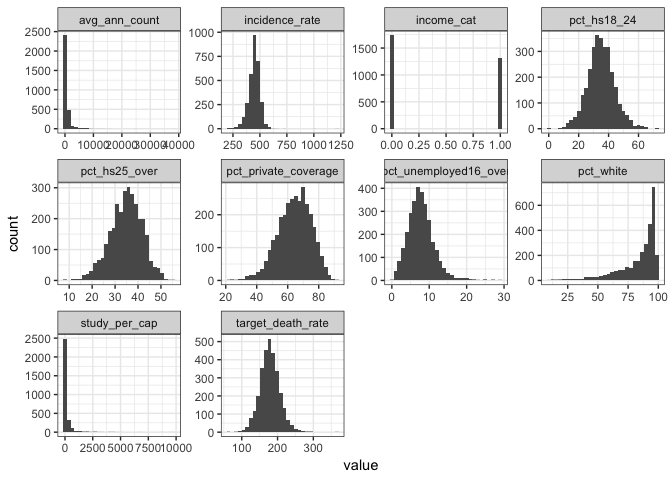
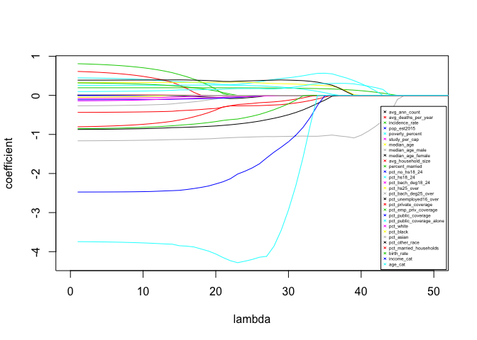

p8130\_final\_project
================
Qinyao Wu
12/6/2018

``` r
#Import data
cancer_data = read_csv("./data/Cancer_Registry.csv") 
```

    ## Parsed with column specification:
    ## cols(
    ##   .default = col_double(),
    ##   avgDeathsPerYear = col_integer(),
    ##   medIncome = col_integer(),
    ##   popEst2015 = col_integer(),
    ##   binnedInc = col_character(),
    ##   Geography = col_character()
    ## )

    ## See spec(...) for full column specifications.

``` r
#Count na, modify the na table to show the variable with NAs. 
cancer_na = map_df(cancer_data, function(x) sum(is.na(x))) %>% data.frame() %>%
  t() %>% data.frame()

#Add column names.
colnames(cancer_na) = "na_counts"

#Make a table for na. 
cancer_na = cancer_na %>% mutate(variable_name = row.names(cancer_na)) %>% dplyr::select(2, 1) %>%
  filter(na_counts > 0) %>% knitr::kable()
cancer_na
```

| variable\_name          |  na\_counts|
|:------------------------|-----------:|
| PctSomeCol18\_24        |        2285|
| PctEmployed16\_Over     |         152|
| PctPrivateCoverageAlone |         609|

``` r
#Tidy the data set. 
cancer_data_analysis = cancer_data %>% 
  janitor::clean_names() %>% 

  #Make income a dummy variable by divide up by mean of income. 
  mutate(med_income = as.numeric(med_income) ) %>% 
  mutate(income_cat = ifelse(med_income >= mean(med_income), 1, 0)) %>% 
  
  #Divide up ages by mean of age. 
  mutate(age_cat = ifelse(median_age >= mean(median_age), 1, 0)) %>%
  
  #remove variables with a lot of na, pct_employed16_over do not have a lot, so we decide to keep it. 
  dplyr::select(-pct_some_col18_24, -pct_private_coverage_alone, -med_income) %>% 
  
  #remove unrelated variables
  dplyr::select(-binned_inc) %>% 
 
  #Make the y at the first column. 
  dplyr::select(target_death_rate, everything())
  
 #Skim over all the variables.  
cancer_data_analysis %>% 
  dplyr::select(-geography) %>% 

 skimr::skim()
```

    ## Skim summary statistics
    ##  n obs: 3047 
    ##  n variables: 31 
    ## 
    ## ── Variable type:integer ───────────────────────────────────────────────────────
    ##             variable missing complete    n     mean        sd  p0   p25
    ##  avg_deaths_per_year       0     3047 3047   185.97    504.13   3    28
    ##          pop_est2015       0     3047 3047 1e+05    329059.22 827 11684
    ##    p50   p75  p100     hist
    ##     61   149 14010 ▇▁▁▁▁▁▁▁
    ##  26643 68671 1e+07 ▇▁▁▁▁▁▁▁
    ## 
    ## ── Variable type:numeric ───────────────────────────────────────────────────────
    ##                   variable missing complete    n   mean      sd      p0
    ##                    age_cat       0     3047 3047   0.18    0.39   0    
    ##              avg_ann_count       0     3047 3047 606.34 1416.36   6    
    ##         avg_household_size       0     3047 3047   2.48    0.43   0.022
    ##                 birth_rate       0     3047 3047   5.64    1.99   0    
    ##             incidence_rate       0     3047 3047 448.27   54.56 201.3  
    ##                 income_cat       0     3047 3047   0.43    0.5    0    
    ##                 median_age       0     3047 3047  45.27   45.3   22.3  
    ##          median_age_female       0     3047 3047  42.15    5.29  22.3  
    ##            median_age_male       0     3047 3047  39.57    5.23  22.4  
    ##                  pct_asian       0     3047 3047   1.25    2.61   0    
    ##          pct_bach_deg18_24       0     3047 3047   6.16    4.53   0    
    ##        pct_bach_deg25_over       0     3047 3047  13.28    5.39   2.5  
    ##                  pct_black       0     3047 3047   9.11   14.53   0    
    ##      pct_emp_priv_coverage       0     3047 3047  41.2     9.45  13.5  
    ##        pct_employed16_over     152     2895 3047  54.15    8.32  17.6  
    ##                pct_hs18_24       0     3047 3047  35       9.07   0    
    ##              pct_hs25_over       0     3047 3047  34.8     7.03   7.5  
    ##     pct_married_households       0     3047 3047  51.24    6.57  22.99 
    ##             pct_no_hs18_24       0     3047 3047  18.22    8.09   0    
    ##             pct_other_race       0     3047 3047   1.98    3.52   0    
    ##       pct_private_coverage       0     3047 3047  64.35   10.65  22.3  
    ##        pct_public_coverage       0     3047 3047  36.25    7.84  11.2  
    ##  pct_public_coverage_alone       0     3047 3047  19.24    6.11   2.6  
    ##      pct_unemployed16_over       0     3047 3047   7.85    3.45   0.4  
    ##                  pct_white       0     3047 3047  83.65   16.38  10.2  
    ##            percent_married       0     3047 3047  51.77    6.9   23.1  
    ##            poverty_percent       0     3047 3047  16.88    6.41   3.2  
    ##              study_per_cap       0     3047 3047 155.4   529.63   0    
    ##          target_death_rate       0     3047 3047 178.66   27.75  59.7  
    ##     p25    p50    p75     p100     hist
    ##    0      0      0        1    ▇▁▁▁▁▁▁▂
    ##   76    171    518    38150    ▇▁▁▁▁▁▁▁
    ##    2.37   2.5    2.63     3.97 ▁▁▁▁▇▇▁▁
    ##    4.52   5.38   6.49    21.33 ▁▇▇▂▁▁▁▁
    ##  420.3  453.55 480.85  1206.9  ▁▇▇▁▁▁▁▁
    ##    0      0      1        1    ▇▁▁▁▁▁▁▆
    ##   37.7   41     44      624    ▇▁▁▁▁▁▁▁
    ##   39.1   42.4   45.3     65.7  ▁▁▃▇▅▁▁▁
    ##   36.35  39.6   42.5     64.7  ▁▂▆▇▃▁▁▁
    ##    0.25   0.55   1.22    42.62 ▇▁▁▁▁▁▁▁
    ##    3.1    5.4    8.2     51.8  ▇▅▁▁▁▁▁▁
    ##    9.4   12.3   16.1     42.2  ▂▇▆▃▁▁▁▁
    ##    0.62   2.25  10.51    85.95 ▇▁▁▁▁▁▁▁
    ##   34.5   41.1   47.7     70.7  ▁▂▆▇▇▅▁▁
    ##   48.6   54.5   60.3     80.1  ▁▁▁▅▇▇▂▁
    ##   29.2   34.7   40.7     72.5  ▁▁▃▇▆▂▁▁
    ##   30.4   35.3   39.65    54.8  ▁▁▂▅▇▆▂▁
    ##   47.76  51.67  55.4     78.08 ▁▁▂▆▇▂▁▁
    ##   12.8   17.1   22.7     64.1  ▂▇▇▃▁▁▁▁
    ##    0.3    0.83   2.18    41.93 ▇▁▁▁▁▁▁▁
    ##   57.2   65.1   72.1     92.3  ▁▁▂▅▇▇▅▁
    ##   30.9   36.3   41.55    65.1  ▁▂▅▇▇▃▁▁
    ##   14.85  18.8   23.1     46.6  ▁▃▇▇▃▁▁▁
    ##    5.5    7.6    9.7     29.4  ▂▇▇▂▁▁▁▁
    ##   77.3   90.06  95.45   100    ▁▁▁▁▁▂▃▇
    ##   47.75  52.4   56.4     72.5  ▁▁▁▅▇▇▂▁
    ##   12.15  15.9   20.4     47.4  ▂▇▇▅▂▁▁▁
    ##    0      0     83.65  9762.31 ▇▁▁▁▁▁▁▁
    ##  161.2  178.1  195.2    362.8  ▁▁▆▇▂▁▁▁

``` r
#Look at the overall correlation. 
cancer_data_analysis %>% 
  dplyr::select(-geography) %>% 
  cor() %>% 
  knitr::kable()
```

|                              |  target\_death\_rate|  avg\_ann\_count|  avg\_deaths\_per\_year|  incidence\_rate|  pop\_est2015|  poverty\_percent|  study\_per\_cap|  median\_age|  median\_age\_male|  median\_age\_female|  avg\_household\_size|  percent\_married|  pct\_no\_hs18\_24|  pct\_hs18\_24|  pct\_bach\_deg18\_24|  pct\_hs25\_over|  pct\_bach\_deg25\_over|  pct\_employed16\_over|  pct\_unemployed16\_over|  pct\_private\_coverage|  pct\_emp\_priv\_coverage|  pct\_public\_coverage|  pct\_public\_coverage\_alone|  pct\_white|  pct\_black|  pct\_asian|  pct\_other\_race|  pct\_married\_households|  birth\_rate|  income\_cat|    age\_cat|
|------------------------------|--------------------:|----------------:|-----------------------:|----------------:|-------------:|-----------------:|----------------:|------------:|------------------:|--------------------:|---------------------:|-----------------:|------------------:|--------------:|---------------------:|----------------:|-----------------------:|----------------------:|------------------------:|-----------------------:|-------------------------:|----------------------:|-----------------------------:|-----------:|-----------:|-----------:|-----------------:|-------------------------:|------------:|------------:|-----------:|
| target\_death\_rate          |            1.0000000|       -0.1435316|              -0.0907152|        0.4494317|    -0.1200731|         0.4293890|       -0.0222850|    0.0043751|         -0.0219294|            0.0120484|            -0.0369053|        -0.2668205|          0.0884626|      0.2619759|            -0.2878174|        0.4045891|              -0.4854773|                     NA|                0.3784124|              -0.3860655|                -0.2673994|              0.4045717|                     0.4493576|  -0.1774000|   0.2570236|  -0.1863311|        -0.1898936|                -0.2933253|   -0.0874070|   -0.3682438|  -0.1112003|
| avg\_ann\_count              |           -0.1435316|        1.0000000|               0.9394078|        0.0735532|     0.9268935|        -0.1356939|        0.0820714|   -0.0240975|         -0.1249686|           -0.1228441|             0.0647878|        -0.1061077|         -0.1433269|     -0.1820539|             0.2841762|       -0.3113752|               0.3210206|                     NA|               -0.0090158|               0.1322444|                 0.2023489|             -0.1735483|                    -0.0936991|  -0.1365011|   0.0313756|   0.4350712|         0.2091838|                -0.1062209|   -0.0345076|    0.2192454|  -0.0743736|
| avg\_deaths\_per\_year       |           -0.0907152|        0.9394078|               1.0000000|        0.0626899|     0.9776341|        -0.0669179|        0.0634883|   -0.0245987|         -0.1484872|           -0.1440692|             0.0861615|        -0.1810291|         -0.1367942|     -0.1514178|             0.2597608|       -0.2959294|               0.2932098|                     NA|                0.0697006|               0.0561826|                 0.1601237|             -0.1316865|                    -0.0273380|  -0.1871590|   0.0846071|   0.4430742|         0.2151494|                -0.1602661|   -0.0744200|    0.1669993|  -0.0939190|
| incidence\_rate              |            0.4494317|        0.0735532|               0.0626899|        1.0000000|     0.0269124|         0.0090463|        0.0772826|    0.0180892|         -0.0147332|           -0.0091056|            -0.1184000|        -0.1195245|         -0.1707621|      0.0226438|             0.0468354|        0.1217246|              -0.0381772|                     NA|                0.0999795|               0.1051743|                 0.1498245|              0.0461086|                     0.0408123|  -0.0145098|   0.1134890|  -0.0081234|        -0.2087483|                -0.1521763|   -0.1181813|    0.0080758|  -0.0780863|
| pop\_est2015                 |           -0.1200731|        0.9268935|               0.9776341|        0.0269124|     1.0000000|        -0.0652991|        0.0557215|   -0.0252190|         -0.1766076|           -0.1779323|             0.1099404|        -0.1604633|         -0.1265824|     -0.1518212|             0.2483754|       -0.3118492|               0.2974634|                     NA|                0.0507681|               0.0526765|                 0.1586495|             -0.1600656|                    -0.0414688|  -0.1900945|   0.0730441|   0.4641678|         0.2414680|                -0.1279795|   -0.0577402|    0.1763925|  -0.1000458|
| poverty\_percent             |            0.4293890|       -0.1356939|              -0.0669179|        0.0090463|    -0.0652991|         1.0000000|       -0.0556524|   -0.0292800|         -0.2140010|           -0.1481635|             0.0743076|        -0.6428569|          0.2881064|      0.0942111|            -0.3871219|        0.1943612|              -0.5315997|                     NA|                0.6551481|              -0.8225343|                -0.6830997|              0.6511621|                     0.7986420|  -0.5094328|   0.5115297|  -0.1572887|         0.0470959|                -0.6049528|   -0.0122825|   -0.6679347|  -0.1051837|
| study\_per\_cap              |           -0.0222850|        0.0820714|               0.0634883|        0.0772826|     0.0557215|        -0.0556524|        1.0000000|   -0.0260298|         -0.0366473|           -0.0305770|            -0.0040709|        -0.0381433|         -0.0903873|     -0.0570351|             0.0638191|       -0.0851280|               0.1085938|                     NA|               -0.0319568|               0.0925447|                 0.1000632|             -0.0514967|                    -0.0555120|   0.0232910|  -0.0197612|   0.0625431|        -0.0152475|                -0.0517356|    0.0106762|    0.0619825|  -0.0249803|
| median\_age                  |            0.0043751|       -0.0240975|              -0.0245987|        0.0180892|    -0.0252190|        -0.0292800|       -0.0260298|    1.0000000|          0.1291195|            0.1246784|            -0.0319441|         0.0463715|          0.0061781|      0.0505737|            -0.0169094|        0.0365874|              -0.0203522|                     NA|                0.0185904|               0.0046651|                -0.0369265|              0.0490602|                    -0.0032979|   0.0350094|  -0.0171732|  -0.0384239|        -0.0302765|                 0.0145036|   -0.0082762|   -0.0130243|   0.2824866|
| median\_age\_male            |           -0.0219294|       -0.1249686|              -0.1484872|       -0.0147332|    -0.1766076|        -0.2140010|       -0.0366473|    0.1291195|          1.0000000|            0.9336961|            -0.3431887|         0.4499862|          0.1004855|      0.2413099|            -0.0341352|        0.3182771|              -0.1315994|                     NA|               -0.1427375|               0.0822318|                -0.2086640|              0.3989672|                     0.0024787|   0.3980444|  -0.2427481|  -0.2383224|        -0.2666554|                 0.2222777|   -0.1041052|   -0.0768562|   0.6672081|
| median\_age\_female          |            0.0120484|       -0.1228441|              -0.1440692|       -0.0091056|    -0.1779323|        -0.1481635|       -0.0305770|    0.1246784|          0.9336961|            1.0000000|            -0.3675851|         0.3752080|          0.1363613|      0.2428273|            -0.0706990|        0.3448397|              -0.1808453|                     NA|               -0.1111613|               0.0469092|                -0.2522211|              0.4554965|                     0.0476591|   0.3398039|  -0.1567284|  -0.2587479|        -0.2741196|                 0.1615068|   -0.0988126|   -0.1265069|   0.6290699|
| avg\_household\_size         |           -0.0369053|        0.0647878|               0.0861615|       -0.1184000|     0.1099404|         0.0743076|       -0.0040709|   -0.0319441|         -0.3431887|           -0.3675851|             1.0000000|        -0.1005117|          0.0647186|      0.0272282|            -0.0609608|       -0.1387284|               0.0139178|                     NA|                0.1315063|              -0.1443906|                 0.0111112|             -0.1348122|                     0.0611147|  -0.1884458|   0.0302780|   0.1315354|         0.2294396|                 0.0914504|    0.0759176|    0.0635961|  -0.2154383|
| percent\_married             |           -0.2668205|       -0.1061077|              -0.1810291|       -0.1195245|    -0.1604633|        -0.6428569|       -0.0381433|    0.0463715|          0.4499862|            0.3752080|            -0.1005117|         1.0000000|         -0.0123746|      0.1327924|             0.0530373|        0.1024337|               0.1035852|                     NA|               -0.5514835|               0.4494516|                 0.2328991|             -0.2469715|                    -0.4599899|   0.6774199|  -0.6223573|  -0.1486913|        -0.1046694|                 0.8702605|    0.1414039|    0.3050008|   0.2715222|
| pct\_no\_hs18\_24            |            0.0884626|       -0.1433269|              -0.1367942|       -0.1707621|    -0.1265824|         0.2881064|       -0.0903873|    0.0061781|          0.1004855|            0.1363613|             0.0647186|        -0.0123746|          1.0000000|      0.0846293|            -0.3814220|        0.2170695|              -0.3965786|                     NA|                0.1811932|              -0.4547508|                -0.4299940|              0.3185403|                     0.3272698|  -0.1572823|   0.1168052|  -0.2175346|         0.1262564|                 0.0053396|    0.1258948|   -0.2357460|   0.0369420|
| pct\_hs18\_24                |            0.2619759|       -0.1820539|              -0.1514178|        0.0226438|    -0.1518212|         0.0942111|       -0.0570351|    0.0505737|          0.2413099|            0.2428273|             0.0272282|         0.1327924|          0.0846293|      1.0000000|            -0.3893339|        0.4389291|              -0.4047540|                     NA|                0.1306941|              -0.2538507|                -0.2444941|              0.2782205|                     0.2341240|   0.0453064|  -0.0248679|  -0.1997705|        -0.0604148|                 0.1200402|    0.0582269|   -0.1565607|   0.1085555|
| pct\_bach\_deg18\_24         |           -0.2878174|        0.2841762|               0.2597608|        0.0468354|     0.2483754|        -0.3871219|        0.0638191|   -0.0169094|         -0.0341352|           -0.0706990|            -0.0609608|         0.0530373|         -0.3814220|     -0.3893339|             1.0000000|       -0.3840488|               0.5998142|                     NA|               -0.3089197|               0.4877417|                 0.4509961|             -0.4224703|                    -0.4218046|   0.0691328|  -0.0936140|   0.3458828|         0.0065469|                -0.0001044|   -0.1250735|    0.3484920|  -0.0132222|
| pct\_hs25\_over              |            0.4045891|       -0.3113752|              -0.2959294|        0.1217246|    -0.3118492|         0.1943612|       -0.0851280|    0.0365874|          0.3182771|            0.3448397|            -0.1387284|         0.1024337|          0.2170695|      0.4389291|            -0.3840488|        1.0000000|              -0.7406112|                     NA|                0.0823055|              -0.2219348|                -0.2228030|              0.4279738|                     0.2971434|   0.1880448|  -0.0244453|  -0.4365609|        -0.2856111|                 0.0621759|    0.0166003|   -0.3440493|   0.0756209|
| pct\_bach\_deg25\_over       |           -0.4854773|        0.3210206|               0.2932098|       -0.0381772|     0.2974634|        -0.5315997|        0.1085938|   -0.0203522|         -0.1315994|           -0.1808453|             0.0139178|         0.1035852|         -0.3965786|     -0.4047540|             0.5998142|       -0.7406112|               1.0000000|                     NA|               -0.3729800|               0.6032477|                 0.5390836|             -0.6360948|                    -0.6057599|   0.0486523|  -0.1464087|   0.4379629|         0.0390755|                 0.0981339|   -0.0879403|    0.5324528|   0.0029192|
| pct\_employed16\_over        |                   NA|               NA|                      NA|               NA|            NA|                NA|               NA|           NA|                 NA|                   NA|                    NA|                NA|                 NA|             NA|                    NA|               NA|                      NA|                      1|                       NA|                      NA|                        NA|                     NA|                            NA|          NA|          NA|          NA|                NA|                        NA|           NA|           NA|          NA|
| pct\_unemployed16\_over      |            0.3784124|       -0.0090158|               0.0697006|        0.0999795|     0.0507681|         0.6551481|       -0.0319568|    0.0185904|         -0.1427375|           -0.1111613|             0.1315063|        -0.5514835|          0.1811932|      0.1306941|            -0.3089197|        0.0823055|              -0.3729800|                     NA|                1.0000000|              -0.6343173|                -0.4747452|              0.5298213|                     0.6553657|  -0.5017552|   0.4692731|  -0.0220203|         0.0284632|                -0.4696090|   -0.0679063|   -0.4091215|  -0.0909133|
| pct\_private\_coverage       |           -0.3860655|        0.1322444|               0.0561826|        0.1051743|     0.0526765|        -0.8225343|        0.0925447|    0.0046651|          0.0822318|            0.0469092|            -0.1443906|         0.4494516|         -0.4547508|     -0.2538507|             0.4877417|       -0.2219348|               0.6032477|                     NA|               -0.6343173|               1.0000000|                 0.8274588|             -0.7200115|                    -0.8862337|   0.4290314|  -0.3451721|   0.1893318|        -0.1763003|                 0.4346401|   -0.0404366|    0.6204200|   0.0353271|
| pct\_emp\_priv\_coverage     |           -0.2673994|        0.2023489|               0.1601237|        0.1498245|     0.1586495|        -0.6830997|        0.1000632|   -0.0369265|         -0.2086640|           -0.2522211|             0.0111112|         0.2328991|         -0.4299940|     -0.2444941|             0.4509961|       -0.2228030|               0.5390836|                     NA|               -0.4747452|               0.8274588|                 1.0000000|             -0.7783148|                    -0.7288230|   0.2698150|  -0.2373880|   0.2824843|        -0.0642260|                 0.3225693|   -0.0938780|    0.6217880|  -0.2519667|
| pct\_public\_coverage        |            0.4045717|       -0.1735483|              -0.1316865|        0.0461086|    -0.1600656|         0.6511621|       -0.0514967|    0.0490602|          0.3989672|            0.4554965|            -0.1348122|        -0.2469715|          0.3185403|      0.2782205|            -0.4224703|        0.4279738|              -0.6360948|                     NA|                0.5298213|              -0.7200115|                -0.7783148|              1.0000000|                     0.8658328|  -0.1337051|   0.1955975|  -0.3056255|        -0.0787078|                -0.3621705|   -0.0305308|   -0.6166456|   0.2704758|
| pct\_public\_coverage\_alone |            0.4493576|       -0.0936991|              -0.0273380|        0.0408123|    -0.0414688|         0.7986420|       -0.0555120|   -0.0032979|          0.0024787|            0.0476591|             0.0611147|        -0.4599899|          0.3272698|      0.2341240|            -0.4218046|        0.2971434|              -0.6057599|                     NA|                0.6553657|              -0.8862337|                -0.7288230|              0.8658328|                     1.0000000|  -0.3610264|   0.3301103|  -0.1813802|         0.0837554|                -0.4739939|   -0.0047527|   -0.6001150|  -0.0265985|
| pct\_white                   |           -0.1774000|       -0.1365011|              -0.1871590|       -0.0145098|    -0.1900945|        -0.5094328|        0.0232910|    0.0350094|          0.3980444|            0.3398039|            -0.1884458|         0.6774199|         -0.1572823|      0.0453064|             0.0691328|        0.1880448|               0.0486523|                     NA|               -0.5017552|               0.4290314|                 0.2698150|             -0.1337051|                    -0.3610264|   1.0000000|  -0.8284589|  -0.2656764|        -0.2336924|                 0.5967711|   -0.0089581|    0.1640335|   0.2093192|
| pct\_black                   |            0.2570236|        0.0313756|               0.0846071|        0.1134890|     0.0730441|         0.5115297|       -0.0197612|   -0.0171732|         -0.2427481|           -0.1567284|             0.0302780|        -0.6223573|          0.1168052|     -0.0248679|            -0.0936140|       -0.0244453|              -0.1464087|                     NA|                0.4692731|              -0.3451721|                -0.2373880|              0.1955975|                     0.3301103|  -0.8284589|   1.0000000|   0.0165834|        -0.0230013|                -0.5735925|   -0.0678048|   -0.2256673|  -0.1625032|
| pct\_asian                   |           -0.1863311|        0.4350712|               0.4430742|       -0.0081234|     0.4641678|        -0.1572887|        0.0625431|   -0.0384239|         -0.2383224|           -0.2587479|             0.1315354|        -0.1486913|         -0.2175346|     -0.1997705|             0.3458828|       -0.4365609|               0.4379629|                     NA|               -0.0220203|               0.1893318|                 0.2824843|             -0.3056255|                    -0.1813802|  -0.2656764|   0.0165834|   1.0000000|         0.2007811|                -0.0866020|   -0.0619470|    0.2440280|  -0.1274637|
| pct\_other\_race             |           -0.1898936|        0.2091838|               0.2151494|       -0.2087483|     0.2414680|         0.0470959|       -0.0152475|   -0.0302765|         -0.2666554|           -0.2741196|             0.2294396|        -0.1046694|          0.1262564|     -0.0604148|             0.0065469|       -0.2856111|               0.0390755|                     NA|                0.0284632|              -0.1763003|                -0.0642260|             -0.0787078|                     0.0837554|  -0.2336924|  -0.0230013|   0.2007811|         1.0000000|                -0.0273523|    0.0598295|    0.0773846|  -0.1250206|
| pct\_married\_households     |           -0.2933253|       -0.1062209|              -0.1602661|       -0.1521763|    -0.1279795|        -0.6049528|       -0.0517356|    0.0145036|          0.2222777|            0.1615068|             0.0914504|         0.8702605|          0.0053396|      0.1200402|            -0.0001044|        0.0621759|               0.0981339|                     NA|               -0.4696090|               0.4346401|                 0.3225693|             -0.3621705|                    -0.4739939|   0.5967711|  -0.5735925|  -0.0866020|        -0.0273523|                 1.0000000|    0.1022633|    0.3540216|   0.0989325|
| birth\_rate                  |           -0.0874070|       -0.0345076|              -0.0744200|       -0.1181813|    -0.0577402|        -0.0122825|        0.0106762|   -0.0082762|         -0.1041052|           -0.0988126|             0.0759176|         0.1414039|          0.1258948|      0.0582269|            -0.1250735|        0.0166003|              -0.0879403|                     NA|               -0.0679063|              -0.0404366|                -0.0938780|             -0.0305308|                    -0.0047527|  -0.0089581|  -0.0678048|  -0.0619470|         0.0598295|                 0.1022633|    1.0000000|    0.0273758|  -0.0223198|
| income\_cat                  |           -0.3682438|        0.2192454|               0.1669993|        0.0080758|     0.1763925|        -0.6679347|        0.0619825|   -0.0130243|         -0.0768562|           -0.1265069|             0.0635961|         0.3050008|         -0.2357460|     -0.1565607|             0.3484920|       -0.3440493|               0.5324528|                     NA|               -0.4091215|               0.6204200|                 0.6217880|             -0.6166456|                    -0.6001150|   0.1640335|  -0.2256673|   0.2440280|         0.0773846|                 0.3540216|    0.0273758|    1.0000000|  -0.0768851|
| age\_cat                     |           -0.1112003|       -0.0743736|              -0.0939190|       -0.0780863|    -0.1000458|        -0.1051837|       -0.0249803|    0.2824866|          0.6672081|            0.6290699|            -0.2154383|         0.2715222|          0.0369420|      0.1085555|            -0.0132222|        0.0756209|               0.0029192|                     NA|               -0.0909133|               0.0353271|                -0.2519667|              0.2704758|                    -0.0265985|   0.2093192|  -0.1625032|  -0.1274637|        -0.1250206|                 0.0989325|   -0.0223198|   -0.0768851|   1.0000000|

``` r
summary(cancer_data_analysis)
```

    ##  target_death_rate avg_ann_count     avg_deaths_per_year incidence_rate  
    ##  Min.   : 59.7     Min.   :    6.0   Min.   :    3       Min.   : 201.3  
    ##  1st Qu.:161.2     1st Qu.:   76.0   1st Qu.:   28       1st Qu.: 420.3  
    ##  Median :178.1     Median :  171.0   Median :   61       Median : 453.5  
    ##  Mean   :178.7     Mean   :  606.3   Mean   :  186       Mean   : 448.3  
    ##  3rd Qu.:195.2     3rd Qu.:  518.0   3rd Qu.:  149       3rd Qu.: 480.9  
    ##  Max.   :362.8     Max.   :38150.0   Max.   :14010       Max.   :1206.9  
    ##                                                                          
    ##   pop_est2015       poverty_percent study_per_cap       median_age    
    ##  Min.   :     827   Min.   : 3.20   Min.   :   0.00   Min.   : 22.30  
    ##  1st Qu.:   11684   1st Qu.:12.15   1st Qu.:   0.00   1st Qu.: 37.70  
    ##  Median :   26643   Median :15.90   Median :   0.00   Median : 41.00  
    ##  Mean   :  102637   Mean   :16.88   Mean   : 155.40   Mean   : 45.27  
    ##  3rd Qu.:   68671   3rd Qu.:20.40   3rd Qu.:  83.65   3rd Qu.: 44.00  
    ##  Max.   :10170292   Max.   :47.40   Max.   :9762.31   Max.   :624.00  
    ##                                                                       
    ##  median_age_male median_age_female  geography         avg_household_size
    ##  Min.   :22.40   Min.   :22.30     Length:3047        Min.   :0.0221    
    ##  1st Qu.:36.35   1st Qu.:39.10     Class :character   1st Qu.:2.3700    
    ##  Median :39.60   Median :42.40     Mode  :character   Median :2.5000    
    ##  Mean   :39.57   Mean   :42.15                        Mean   :2.4797    
    ##  3rd Qu.:42.50   3rd Qu.:45.30                        3rd Qu.:2.6300    
    ##  Max.   :64.70   Max.   :65.70                        Max.   :3.9700    
    ##                                                                         
    ##  percent_married pct_no_hs18_24   pct_hs18_24   pct_bach_deg18_24
    ##  Min.   :23.10   Min.   : 0.00   Min.   : 0.0   Min.   : 0.000   
    ##  1st Qu.:47.75   1st Qu.:12.80   1st Qu.:29.2   1st Qu.: 3.100   
    ##  Median :52.40   Median :17.10   Median :34.7   Median : 5.400   
    ##  Mean   :51.77   Mean   :18.22   Mean   :35.0   Mean   : 6.158   
    ##  3rd Qu.:56.40   3rd Qu.:22.70   3rd Qu.:40.7   3rd Qu.: 8.200   
    ##  Max.   :72.50   Max.   :64.10   Max.   :72.5   Max.   :51.800   
    ##                                                                  
    ##  pct_hs25_over   pct_bach_deg25_over pct_employed16_over
    ##  Min.   : 7.50   Min.   : 2.50       Min.   :17.60      
    ##  1st Qu.:30.40   1st Qu.: 9.40       1st Qu.:48.60      
    ##  Median :35.30   Median :12.30       Median :54.50      
    ##  Mean   :34.80   Mean   :13.28       Mean   :54.15      
    ##  3rd Qu.:39.65   3rd Qu.:16.10       3rd Qu.:60.30      
    ##  Max.   :54.80   Max.   :42.20       Max.   :80.10      
    ##                                      NA's   :152        
    ##  pct_unemployed16_over pct_private_coverage pct_emp_priv_coverage
    ##  Min.   : 0.400        Min.   :22.30        Min.   :13.5         
    ##  1st Qu.: 5.500        1st Qu.:57.20        1st Qu.:34.5         
    ##  Median : 7.600        Median :65.10        Median :41.1         
    ##  Mean   : 7.852        Mean   :64.35        Mean   :41.2         
    ##  3rd Qu.: 9.700        3rd Qu.:72.10        3rd Qu.:47.7         
    ##  Max.   :29.400        Max.   :92.30        Max.   :70.7         
    ##                                                                  
    ##  pct_public_coverage pct_public_coverage_alone   pct_white     
    ##  Min.   :11.20       Min.   : 2.60             Min.   : 10.20  
    ##  1st Qu.:30.90       1st Qu.:14.85             1st Qu.: 77.30  
    ##  Median :36.30       Median :18.80             Median : 90.06  
    ##  Mean   :36.25       Mean   :19.24             Mean   : 83.65  
    ##  3rd Qu.:41.55       3rd Qu.:23.10             3rd Qu.: 95.45  
    ##  Max.   :65.10       Max.   :46.60             Max.   :100.00  
    ##                                                                
    ##    pct_black         pct_asian       pct_other_race   
    ##  Min.   : 0.0000   Min.   : 0.0000   Min.   : 0.0000  
    ##  1st Qu.: 0.6207   1st Qu.: 0.2542   1st Qu.: 0.2952  
    ##  Median : 2.2476   Median : 0.5498   Median : 0.8262  
    ##  Mean   : 9.1080   Mean   : 1.2540   Mean   : 1.9835  
    ##  3rd Qu.:10.5097   3rd Qu.: 1.2210   3rd Qu.: 2.1780  
    ##  Max.   :85.9478   Max.   :42.6194   Max.   :41.9303  
    ##                                                       
    ##  pct_married_households   birth_rate       income_cat        age_cat      
    ##  Min.   :22.99          Min.   : 0.000   Min.   :0.0000   Min.   :0.0000  
    ##  1st Qu.:47.76          1st Qu.: 4.521   1st Qu.:0.0000   1st Qu.:0.0000  
    ##  Median :51.67          Median : 5.381   Median :0.0000   Median :0.0000  
    ##  Mean   :51.24          Mean   : 5.640   Mean   :0.4306   Mean   :0.1844  
    ##  3rd Qu.:55.40          3rd Qu.: 6.494   3rd Qu.:1.0000   3rd Qu.:0.0000  
    ##  Max.   :78.08          Max.   :21.326   Max.   :1.0000   Max.   :1.0000  
    ## 

``` r
#Choose variables we are interested in and the variables from primary literature.  

#Reasons for choosing these variables:

# compared the employed status
# compare the education status
# white has the largest percentage, so we decide to choose white.

cancer_s = cancer_data_analysis %>%
  dplyr::select(target_death_rate, avg_ann_count, incidence_rate, pct_unemployed16_over, age_cat, pct_private_coverage, pct_white, pct_hs25_over, pct_hs18_24, geography)

rownames(cancer_s) = cancer_s$geography
```

    ## Warning: Setting row names on a tibble is deprecated.

``` r
cancer_s = cancer_s %>% 
  select(-geography)

#Look at the covariance between the variables. 
cor(cancer_s) %>% knitr::kable()
```

|                         |  target\_death\_rate|  avg\_ann\_count|  incidence\_rate|  pct\_unemployed16\_over|    age\_cat|  pct\_private\_coverage|  pct\_white|  pct\_hs25\_over|  pct\_hs18\_24|
|-------------------------|--------------------:|----------------:|----------------:|------------------------:|-----------:|-----------------------:|-----------:|----------------:|--------------:|
| target\_death\_rate     |            1.0000000|       -0.1435316|        0.4494317|                0.3784124|  -0.1112003|              -0.3860655|  -0.1774000|        0.4045891|      0.2619759|
| avg\_ann\_count         |           -0.1435316|        1.0000000|        0.0735532|               -0.0090158|  -0.0743736|               0.1322444|  -0.1365011|       -0.3113752|     -0.1820539|
| incidence\_rate         |            0.4494317|        0.0735532|        1.0000000|                0.0999795|  -0.0780863|               0.1051743|  -0.0145098|        0.1217246|      0.0226438|
| pct\_unemployed16\_over |            0.3784124|       -0.0090158|        0.0999795|                1.0000000|  -0.0909133|              -0.6343173|  -0.5017552|        0.0823055|      0.1306941|
| age\_cat                |           -0.1112003|       -0.0743736|       -0.0780863|               -0.0909133|   1.0000000|               0.0353271|   0.2093192|        0.0756209|      0.1085555|
| pct\_private\_coverage  |           -0.3860655|        0.1322444|        0.1051743|               -0.6343173|   0.0353271|               1.0000000|   0.4290314|       -0.2219348|     -0.2538507|
| pct\_white              |           -0.1774000|       -0.1365011|       -0.0145098|               -0.5017552|   0.2093192|               0.4290314|   1.0000000|        0.1880448|      0.0453064|
| pct\_hs25\_over         |            0.4045891|       -0.3113752|        0.1217246|                0.0823055|   0.0756209|              -0.2219348|   0.1880448|        1.0000000|      0.4389291|
| pct\_hs18\_24           |            0.2619759|       -0.1820539|        0.0226438|                0.1306941|   0.1085555|              -0.2538507|   0.0453064|        0.4389291|      1.0000000|

``` r
#Look at the overall distribution and percentiles of the variables we choose.
skimr::skim(cancer_s)
```

    ## Skim summary statistics
    ##  n obs: 3047 
    ##  n variables: 9 
    ## 
    ## ── Variable type:numeric ───────────────────────────────────────────────────────
    ##               variable missing complete    n   mean      sd    p0   p25
    ##                age_cat       0     3047 3047   0.18    0.39   0     0  
    ##          avg_ann_count       0     3047 3047 606.34 1416.36   6    76  
    ##         incidence_rate       0     3047 3047 448.27   54.56 201.3 420.3
    ##            pct_hs18_24       0     3047 3047  35       9.07   0    29.2
    ##          pct_hs25_over       0     3047 3047  34.8     7.03   7.5  30.4
    ##   pct_private_coverage       0     3047 3047  64.35   10.65  22.3  57.2
    ##  pct_unemployed16_over       0     3047 3047   7.85    3.45   0.4   5.5
    ##              pct_white       0     3047 3047  83.65   16.38  10.2  77.3
    ##      target_death_rate       0     3047 3047 178.66   27.75  59.7 161.2
    ##     p50    p75    p100     hist
    ##    0      0        1   ▇▁▁▁▁▁▁▂
    ##  171    518    38150   ▇▁▁▁▁▁▁▁
    ##  453.55 480.85  1206.9 ▁▇▇▁▁▁▁▁
    ##   34.7   40.7     72.5 ▁▁▃▇▆▂▁▁
    ##   35.3   39.65    54.8 ▁▁▂▅▇▆▂▁
    ##   65.1   72.1     92.3 ▁▁▂▅▇▇▅▁
    ##    7.6    9.7     29.4 ▂▇▇▂▁▁▁▁
    ##   90.06  95.45   100   ▁▁▁▁▁▂▃▇
    ##  178.1  195.2    362.8 ▁▁▆▇▂▁▁▁

``` r
cancer_s %>% 
  ggplot(aes(x = target_death_rate)) + 
    geom_histogram(aes(y = ..density..),  
                   binwidth = 2, colour = "black", fill = "white") +
    geom_density(alpha = .1) +
    labs(title = "Distribution of target death")
```


``` r
#Make a histogram set to show the normal distribution of the variables to decide whether transformation is required. 
cancer_s %>%
  dplyr::select(-age_cat) %>%
  gather(measure, value) %>%
  ggplot(aes(value)) +
  facet_wrap(. ~ measure, scales = "free") +
  geom_histogram()
```

    ## `stat_bin()` using `bins = 30`. Pick better value with `binwidth`.



``` r
#Find the significant variables in each number of parameters. Used as a reference for later removal of variables. 
criterion_subset = regsubsets(target_death_rate ~ ., data = cancer_s, nvmax = 34)
   (rs = summary(criterion_subset))
```

    ## Subset selection object
    ## Call: regsubsets.formula(target_death_rate ~ ., data = cancer_s, nvmax = 34)
    ## 8 Variables  (and intercept)
    ##                       Forced in Forced out
    ## avg_ann_count             FALSE      FALSE
    ## incidence_rate            FALSE      FALSE
    ## pct_unemployed16_over     FALSE      FALSE
    ## age_cat                   FALSE      FALSE
    ## pct_private_coverage      FALSE      FALSE
    ## pct_white                 FALSE      FALSE
    ## pct_hs25_over             FALSE      FALSE
    ## pct_hs18_24               FALSE      FALSE
    ## 1 subsets of each size up to 8
    ## Selection Algorithm: exhaustive
    ##          avg_ann_count incidence_rate pct_unemployed16_over age_cat
    ## 1  ( 1 ) " "           "*"            " "                   " "    
    ## 2  ( 1 ) " "           "*"            " "                   " "    
    ## 3  ( 1 ) " "           "*"            " "                   " "    
    ## 4  ( 1 ) " "           "*"            "*"                   " "    
    ## 5  ( 1 ) " "           "*"            "*"                   "*"    
    ## 6  ( 1 ) "*"           "*"            "*"                   "*"    
    ## 7  ( 1 ) "*"           "*"            "*"                   "*"    
    ## 8  ( 1 ) "*"           "*"            "*"                   "*"    
    ##          pct_private_coverage pct_white pct_hs25_over pct_hs18_24
    ## 1  ( 1 ) " "                  " "       " "           " "        
    ## 2  ( 1 ) "*"                  " "       " "           " "        
    ## 3  ( 1 ) "*"                  " "       "*"           " "        
    ## 4  ( 1 ) "*"                  " "       "*"           " "        
    ## 5  ( 1 ) "*"                  " "       "*"           " "        
    ## 6  ( 1 ) "*"                  " "       "*"           " "        
    ## 7  ( 1 ) "*"                  " "       "*"           "*"        
    ## 8  ( 1 ) "*"                  "*"       "*"           "*"

``` r
par(mar = c(4,4,1,1))
par(mfrow = c(1,2))

#Only when the p equals to 9, Cp=8.76 < Parameter. As a result, we decide that the number of predictors would be 9-1 = 8 or 10-1 = 9. So we look back to the significance table and we found that only the study_per_cap is not significant and we decided to remove it. 

plot(2:9, rs$cp, xlab = "No of parameters", ylab = "Cp Statistic")
abline(0,1)

#And at parameter equals to 9, the adjusted r square value is highest. 
plot(2:9, rs$adjr2, xlab = "No of parameters", ylab = "Adj R2")
```


``` r
#So we decide this is our final model. 
cancer_lm = lm(target_death_rate ~ ., data = cancer_s)
summary(cancer_lm)
```

    ## 
    ## Call:
    ## lm(formula = target_death_rate ~ ., data = cancer_s)
    ## 
    ## Residuals:
    ##      Min       1Q   Median       3Q      Max 
    ## -106.719  -11.851    0.029   11.195  138.436 
    ## 
    ## Coefficients:
    ##                         Estimate Std. Error t value Pr(>|t|)    
    ## (Intercept)           83.6354002  5.1423568  16.264  < 2e-16 ***
    ## avg_ann_count         -0.0012182  0.0002744  -4.440 9.31e-06 ***
    ## incidence_rate         0.2190342  0.0070103  31.244  < 2e-16 ***
    ## pct_unemployed16_over  0.8993821  0.1472475   6.108 1.14e-09 ***
    ## age_cat               -5.6381097  0.9655331  -5.839 5.79e-09 ***
    ## pct_private_coverage  -0.6706928  0.0489349 -13.706  < 2e-16 ***
    ## pct_white             -0.0801211  0.0280270  -2.859  0.00428 ** 
    ## pct_hs25_over          1.0065584  0.0627715  16.035  < 2e-16 ***
    ## pct_hs18_24            0.1825604  0.0455351   4.009 6.24e-05 ***
    ## ---
    ## Signif. codes:  0 '***' 0.001 '**' 0.01 '*' 0.05 '.' 0.1 ' ' 1
    ## 
    ## Residual standard error: 20.04 on 3038 degrees of freedom
    ## Multiple R-squared:  0.4802, Adjusted R-squared:  0.4788 
    ## F-statistic: 350.8 on 8 and 3038 DF,  p-value: < 2.2e-16

### Model Diagnostic

``` r
#Add the row names for the data set using the geography column. 
#Apply the model we built. 
cancer_lm = lm(target_death_rate ~ ., data = cancer_s)

## outlier in Y-Look at the studendized ourliers
stu_res = rstandard(cancer_lm)
outliers_y = stu_res[abs(stu_res) > 2.5]

#Make four plots to show whether the assumptions are met. 
par(mfrow = c(2,2))
plot(cancer_lm)
```


``` r
# 1000 might be an influential outlier. 
lev = hatvalues(cancer_lm)
lev[lev > 0.2]
```

    ## Los Angeles County, California 
    ##                      0.2548022

``` r
#a = cancer_data_analysis[-1000,]

#Calculate the DIFFITS to determine the outliers. 
diffits_data = dffits(cancer_lm) %>%
  data.frame()

colnames(diffits_data) = c("diffit")

diffits_outlier = diffits_data %>%
  filter(diffit > 2*sqrt(8/3047))

#not influential outlier change in coef < 6%---decide to keep all obes
cancer_s %>% 
  filter(!(row.names(cancer_s) %in% c("Williamsburg city, Virginia", "Madison County, Mississippi", "Woodson County, Kansas", "Aleutians West Census Area, Alaska", "Los Angeles County, California"))) %>% 
  lm(target_death_rate ~ ., data=.) %>% 
  summary()
```

    ## 
    ## Call:
    ## lm(formula = target_death_rate ~ ., data = .)
    ## 
    ## Residuals:
    ##    Min     1Q Median     3Q    Max 
    ## -94.26 -11.90   0.06  11.16  81.74 
    ## 
    ## Coefficients:
    ##                         Estimate Std. Error t value Pr(>|t|)    
    ## (Intercept)           79.5340895  5.0576987  15.725  < 2e-16 ***
    ## avg_ann_count         -0.0015694  0.0003114  -5.039 4.95e-07 ***
    ## incidence_rate         0.2291456  0.0070425  32.537  < 2e-16 ***
    ## pct_unemployed16_over  0.9512827  0.1443813   6.589 5.21e-11 ***
    ## age_cat               -5.7691627  0.9460907  -6.098 1.21e-09 ***
    ## pct_private_coverage  -0.6748353  0.0480761 -14.037  < 2e-16 ***
    ## pct_white             -0.0654012  0.0275992  -2.370 0.017866 *  
    ## pct_hs25_over          0.9794635  0.0619827  15.802  < 2e-16 ***
    ## pct_hs18_24            0.1622660  0.0446564   3.634 0.000284 ***
    ## ---
    ## Signif. codes:  0 '***' 0.001 '**' 0.01 '*' 0.05 '.' 0.1 ' ' 1
    ## 
    ## Residual standard error: 19.62 on 3033 degrees of freedom
    ## Multiple R-squared:  0.4965, Adjusted R-squared:  0.4951 
    ## F-statistic: 373.8 on 8 and 3033 DF,  p-value: < 2.2e-16

Cross-Validation
================

``` r
# CV for our selected variables
data_train = trainControl(method = "repeatedcv", number = 10, repeats = 10)
# Fit the 4-variables model that we discussed in previous lectures
model_caret <- train(target_death_rate ~ avg_ann_count + incidence_rate + pct_unemployed16_over + age_cat + pct_private_coverage + pct_white + pct_hs25_over + pct_hs18_24, data = cancer_data_analysis,
                   trControl=data_train,
                   method='lm',
                   na.action=na.pass)
model_caret
```

    ## Linear Regression 
    ## 
    ## 3047 samples
    ##    8 predictor
    ## 
    ## No pre-processing
    ## Resampling: Cross-Validated (10 fold, repeated 10 times) 
    ## Summary of sample sizes: 2743, 2742, 2742, 2743, 2742, 2742, ... 
    ## Resampling results:
    ## 
    ##   RMSE      Rsquared   MAE     
    ##   20.06328  0.4772676  14.96998
    ## 
    ## Tuning parameter 'intercept' was held constant at a value of TRUE

``` r
# CV for more variables (including unselected)
data_train_2 = trainControl(method = "repeatedcv", number = 10, repeats = 10)
model_caret_2 = train(target_death_rate ~ incidence_rate + poverty_percent + median_age_female 
                    + percent_married + pct_hs18_24 + pct_hs25_over + pct_bach_deg25_over 
                    + pct_unemployed16_over + pct_private_coverage + pct_emp_priv_coverage 
                    + pct_public_coverage + pct_white + pct_black + pct_other_race + birth_rate, 
                    data = cancer_data_analysis,
                    trControl=data_train_2,
                    method='lm',
                    na.action=na.pass)

RMSE = mean(model_caret_2$resample$RMSE)
RMSE
```

    ## [1] 19.65185

Bootstrap
=========

``` r
boot.fn<-function(data, index){
    return(coef(lm(target_death_rate ~ ., data = data, subset=index)))
}

results = boot(cancer_s, boot.fn, 10000)
rmse(cancer_lm, cancer_s)
```

    ## [1] 20.00552

``` r
plot(results, index = 1)
```


``` r
#results$t[ ,1]

#results_raw = boot(cancer_data_analysis, boot.fn, 10000)
#cancer_overall = lm(target_death_rate ~ ., data = cancer_data_analysis)
#rmse(cancer_overall, cancer_data_analysis)
#plot(results_raw, index = 1)
```

``` r
#install.packages("parcor")
library(parcor)
```

    ## Loading required package: MASS

    ## 
    ## Attaching package: 'MASS'

    ## The following object is masked from 'package:dplyr':
    ## 
    ##     select

    ## Loading required package: glmnet

    ## Loading required package: Matrix

    ## 
    ## Attaching package: 'Matrix'

    ## The following object is masked from 'package:tidyr':
    ## 
    ##     expand

    ## Loading required package: foreach

    ## 
    ## Attaching package: 'foreach'

    ## The following objects are masked from 'package:purrr':
    ## 
    ##     accumulate, when

    ## Loaded glmnet 2.0-16

    ## Loading required package: ppls

    ## Loading required package: splines

    ## Loading required package: Epi

    ## Loading required package: GeneNet

    ## Loading required package: corpcor

    ## Loading required package: longitudinal

    ## Loading required package: fdrtool

``` r
library(MASS)
library(glmnet)
library(reshape2)
```

    ## 
    ## Attaching package: 'reshape2'

    ## The following object is masked from 'package:tidyr':
    ## 
    ##     smiths

``` r
# Start with the full model
mult.fit <- lm(target_death_rate ~ ., data=cancer_s)
summary(mult.fit)
```

    ## 
    ## Call:
    ## lm(formula = target_death_rate ~ ., data = cancer_s)
    ## 
    ## Residuals:
    ##      Min       1Q   Median       3Q      Max 
    ## -106.719  -11.851    0.029   11.195  138.436 
    ## 
    ## Coefficients:
    ##                         Estimate Std. Error t value Pr(>|t|)    
    ## (Intercept)           83.6354002  5.1423568  16.264  < 2e-16 ***
    ## avg_ann_count         -0.0012182  0.0002744  -4.440 9.31e-06 ***
    ## incidence_rate         0.2190342  0.0070103  31.244  < 2e-16 ***
    ## pct_unemployed16_over  0.8993821  0.1472475   6.108 1.14e-09 ***
    ## age_cat               -5.6381097  0.9655331  -5.839 5.79e-09 ***
    ## pct_private_coverage  -0.6706928  0.0489349 -13.706  < 2e-16 ***
    ## pct_white             -0.0801211  0.0280270  -2.859  0.00428 ** 
    ## pct_hs25_over          1.0065584  0.0627715  16.035  < 2e-16 ***
    ## pct_hs18_24            0.1825604  0.0455351   4.009 6.24e-05 ***
    ## ---
    ## Signif. codes:  0 '***' 0.001 '**' 0.01 '*' 0.05 '.' 0.1 ' ' 1
    ## 
    ## Residual standard error: 20.04 on 3038 degrees of freedom
    ## Multiple R-squared:  0.4802, Adjusted R-squared:  0.4788 
    ## F-statistic: 350.8 on 8 and 3038 DF,  p-value: < 2.2e-16

``` r
#Ridge Regression
ridge1 <- lm.ridge(target_death_rate ~., data=cancer_s)
ridge1
```

    ##                               avg_ann_count        incidence_rate 
    ##          83.635400234          -0.001218187           0.219034158 
    ## pct_unemployed16_over               age_cat  pct_private_coverage 
    ##           0.899382075          -5.638109741          -0.670692834 
    ##             pct_white         pct_hs25_over           pct_hs18_24 
    ##          -0.080121146           1.006558361           0.182560358

``` r
# Compare the LS and Ridge coefficients.
# No difference because the default value for lambda (tunning parameter) is set to 0 by default.
coef(ridge1)
```

    ##                               avg_ann_count        incidence_rate 
    ##          83.635400234          -0.001218187           0.219034158 
    ## pct_unemployed16_over               age_cat  pct_private_coverage 
    ##           0.899382075          -5.638109741          -0.670692834 
    ##             pct_white         pct_hs25_over           pct_hs18_24 
    ##          -0.080121146           1.006558361           0.182560358

``` r
coef(mult.fit)
```

    ##           (Intercept)         avg_ann_count        incidence_rate 
    ##          83.635400234          -0.001218187           0.219034158 
    ## pct_unemployed16_over               age_cat  pct_private_coverage 
    ##           0.899382075          -5.638109741          -0.670692834 
    ##             pct_white         pct_hs25_over           pct_hs18_24 
    ##          -0.080121146           1.006558361           0.182560358

``` r
# Try a grid of values for lambda: from 10^-2 to 10^5

grid <- 10^seq(5,-2, length=100)


# Matrix of 100X8 containing coefficients for all 100 values of lambda
ridge2 <- lm.ridge(target_death_rate ~., data=cancer_s, lambda=grid)
dim(coef(ridge2))
```

    ## [1] 100   9

``` r
######################################################
#            Use function glmnet()                   #
######################################################

cancer_df = data.frame(cancer_s)
Y <- cancer_df[,1]
X <- as.matrix(cancer_df[,-1])

# Penalty term: alpha; Ridge alpha=0 (default); Lasso alpha=1 (default)
ridge3<-glmnet(X, Y, alpha = 0, lambda = grid)
dim(coef(ridge3))
```

    ## [1]   9 100

``` r
# Look at lambda and the coeff estimates on position 50
ridge3$lambda[50]
```

    ## [1] 34.30469

``` r
coef(ridge3)[,50]
```

    ##           (Intercept)         avg_ann_count        incidence_rate 
    ##         128.467553728          -0.000824085           0.098208440 
    ## pct_unemployed16_over               age_cat  pct_private_coverage 
    ##           0.853927930          -3.016570749          -0.308865451 
    ##             pct_white         pct_hs25_over           pct_hs18_24 
    ##          -0.073402548           0.555109837           0.206267931

``` r
# L2 norm for Ridge
# sqrt(sum(coef(ridge3)[-1,50]^2))
#Choice of lambda: Cross Validation (CV)
# Choose the training sample: 50:50

set.seed(1)
train<-sample(1:nrow(X),nrow(X)/2)
test<-(-train)
Y.test<-Y[test]

# Use build-in CV function; performs a 10-fold validation by default
# glmnet() generates it's own lambda sequence

set.seed(2)
cv.out<-cv.glmnet(X[train,],Y[train], alpha=0)
plot(cv.out)
```



``` r
# cv.glmnet() object contains the mean cross-validation error (cvm),
# lambda min that gives the minimum cvm, etc.
cv.out
```

    ## $lambda
    ##  [1] 13072.277547 11910.972439 10852.834477  9888.698574  9010.213848
    ##  [6]  8209.771284  7480.437831  6815.896351  6210.390905  5658.676894
    ## [11]  5155.975636  4697.932971  4280.581554  3900.306487  3553.814009
    ## [16]  3238.102967  2950.438824  2688.329971  2449.506146  2231.898771
    ## [21]  2033.623036  1852.961571  1688.349572  1538.361249  1401.697476
    ## [26]  1277.174536  1163.713870  1060.332737   966.135699   880.306867
    ## [31]   802.102831   730.846226   665.919862   606.761377   552.858368
    ## [36]   503.743955   458.992730   418.217081   381.063828   347.211168
    ## [41]   316.365885   288.260812   262.652516   239.319190   218.058733
    ## [46]   198.686996   181.036191   164.953435   150.299426   136.947239
    ## [51]   124.781224   113.696004   103.595564    94.392420    86.006858
    ## [56]    78.366245    71.404404    65.061034    59.281191    54.014813
    ## [61]    49.216286    44.844047    40.860225    37.230316    33.922877
    ## [66]    30.909262    28.163368    25.661412    23.381723    21.304555
    ## [71]    19.411917    17.687416    16.116115    14.684404    13.379882
    ## [76]    12.191250    11.108213    10.121390     9.222233     8.402956
    ## [81]     7.656460     6.976281     6.356528     5.791831     5.277301
    ## [86]     4.808480     4.381308     3.992085     3.637439     3.314299
    ## [91]     3.019866     2.751589     2.507146     2.284418     2.081476
    ## [96]     1.896564     1.728078     1.574560     1.434681
    ## 
    ## $cvm
    ##  [1] 802.2753 799.8879 799.1164 798.7760 798.4030 797.9943 797.5466
    ##  [8] 797.0561 796.5191 795.9310 795.2873 794.5828 793.8120 792.9689
    ## [15] 792.0471 791.0395 789.9386 788.7363 787.4239 785.9919 784.4304
    ## [22] 782.7287 780.8754 778.8585 776.6653 774.2823 771.6956 768.8907
    ## [29] 765.8524 762.5652 759.0135 755.1813 751.0526 746.6120 741.8442
    ## [36] 736.7350 731.2710 725.4406 719.2338 712.6430 705.6633 698.2930
    ## [43] 690.5340 682.3921 673.8776 665.0058 655.7965 646.2750 636.4716
    ## [50] 626.4216 616.1652 605.7469 595.2150 584.6209 574.0183 563.4622
    ## [57] 553.0078 542.7097 532.6207 522.7905 513.2654 504.0868 495.2911
    ## [64] 486.9088 478.9644 471.4759 464.4552 457.9083 451.8353 446.2306
    ## [71] 441.0844 436.3824 432.1071 428.2381 424.7527 421.6269 418.8358
    ## [78] 416.3541 414.1564 412.2180 410.5149 409.0243 407.7244 406.5950
    ## [85] 405.6170 404.7733 404.0478 403.4261 402.8951 402.4432 402.0598
    ## [92] 401.7358 401.4628 401.2337 401.0421 400.8824 400.7500 400.6409
    ## [99] 400.5516
    ## 
    ## $cvsd
    ##  [1] 32.40974 32.29767 32.17703 32.16394 32.14959 32.13386 32.11662
    ##  [8] 32.09773 32.07703 32.05434 32.02950 32.00229 31.97250 31.93988
    ## [15] 31.90419 31.86513 31.82241 31.77569 31.72463 31.66884 31.60791
    ## [22] 31.54139 31.46881 31.38966 31.30341 31.20947 31.10725 30.99610
    ## [29] 30.87535 30.74431 30.60224 30.44840 30.28203 30.10237 29.90866
    ## [36] 29.70015 29.47612 29.23592 28.97895 28.70470 28.41277 28.10295
    ## [43] 27.77515 27.42952 27.06645 26.68663 26.29103 25.88097 25.45816
    ## [50] 25.02466 24.58294 24.13585 23.68661 23.23875 22.79605 22.36251
    ## [57] 21.94217 21.53907 21.15707 20.79972 20.47018 20.17102 19.90420
    ## [64] 19.67093 19.47170 19.30626 19.17365 19.07228 18.99999 18.95459
    ## [71] 18.93322 18.93302 18.95108 18.98456 19.03076 19.08716 19.15146
    ## [78] 19.22160 19.29579 19.37246 19.45029 19.52817 19.60519 19.68063
    ## [85] 19.75390 19.82456 19.89230 19.95690 20.01820 20.07616 20.13074
    ## [92] 20.18198 20.22995 20.27474 20.31647 20.35526 20.39125 20.42465
    ## [99] 20.45557
    ## 
    ## $cvup
    ##  [1] 834.6851 832.1855 831.2934 830.9399 830.5526 830.1282 829.6632
    ##  [8] 829.1539 828.5961 827.9853 827.3168 826.5850 825.7845 824.9088
    ## [15] 823.9513 822.9046 821.7610 820.5120 819.1485 817.6608 816.0383
    ## [22] 814.2701 812.3442 810.2482 807.9687 805.4918 802.8029 799.8868
    ## [29] 796.7277 793.3095 789.6157 785.6297 781.3347 776.7144 771.7529
    ## [36] 766.4351 760.7471 754.6765 748.2127 741.3477 734.0761 726.3960
    ## [43] 718.3091 709.8216 700.9441 691.6924 682.0875 672.1560 661.9298
    ## [50] 651.4463 640.7481 629.8827 618.9016 607.8596 596.8143 585.8247
    ## [57] 574.9500 564.2488 553.7777 543.5902 533.7355 524.2578 515.1953
    ## [64] 506.5798 498.4361 490.7821 483.6288 476.9806 470.8353 465.1852
    ## [71] 460.0176 455.3154 451.0582 447.2227 443.7835 440.7141 437.9873
    ## [78] 435.5757 433.4522 431.5904 429.9652 428.5525 427.3296 426.2756
    ## [85] 425.3709 424.5978 423.9401 423.3829 422.9133 422.5193 422.1906
    ## [92] 421.9178 421.6928 421.5084 421.3585 421.2377 421.1413 421.0656
    ## [99] 421.0072
    ## 
    ## $cvlo
    ##  [1] 769.8656 767.5902 766.9393 766.6121 766.2534 765.8604 765.4300
    ##  [8] 764.9584 764.4420 763.8766 763.2578 762.5805 761.8395 761.0290
    ## [15] 760.1429 759.1744 758.1162 756.9606 755.6993 754.3231 752.8225
    ## [22] 751.1873 749.4066 747.4688 745.3618 743.0728 740.5884 737.8946
    ## [29] 734.9770 731.8209 728.4113 724.7329 720.7706 716.5096 711.9356
    ## [36] 707.0348 701.7949 696.2047 690.2548 683.9383 677.2505 670.1901
    ## [43] 662.7588 654.9626 646.8112 638.3191 629.5055 620.3941 611.0134
    ## [50] 601.3970 591.5823 581.6110 571.5283 561.3821 551.2222 541.0996
    ## [57] 531.0656 521.1707 511.4636 501.9908 492.7952 483.9158 475.3869
    ## [64] 467.2379 459.4927 452.1696 445.2815 438.8360 432.8354 427.2760
    ## [71] 422.1511 417.4494 413.1561 409.2535 405.7219 402.5398 399.6844
    ## [78] 397.1325 394.8606 392.8455 391.0646 389.4961 388.1192 386.9143
    ## [85] 385.8631 384.9487 384.1555 383.4692 382.8769 382.3670 381.9291
    ## [92] 381.5538 381.2329 380.9589 380.7256 380.5272 380.3588 380.2163
    ## [99] 380.0961
    ## 
    ## $nzero
    ##  s0  s1  s2  s3  s4  s5  s6  s7  s8  s9 s10 s11 s12 s13 s14 s15 s16 s17 
    ##   8   8   8   8   8   8   8   8   8   8   8   8   8   8   8   8   8   8 
    ## s18 s19 s20 s21 s22 s23 s24 s25 s26 s27 s28 s29 s30 s31 s32 s33 s34 s35 
    ##   8   8   8   8   8   8   8   8   8   8   8   8   8   8   8   8   8   8 
    ## s36 s37 s38 s39 s40 s41 s42 s43 s44 s45 s46 s47 s48 s49 s50 s51 s52 s53 
    ##   8   8   8   8   8   8   8   8   8   8   8   8   8   8   8   8   8   8 
    ## s54 s55 s56 s57 s58 s59 s60 s61 s62 s63 s64 s65 s66 s67 s68 s69 s70 s71 
    ##   8   8   8   8   8   8   8   8   8   8   8   8   8   8   8   8   8   8 
    ## s72 s73 s74 s75 s76 s77 s78 s79 s80 s81 s82 s83 s84 s85 s86 s87 s88 s89 
    ##   8   8   8   8   8   8   8   8   8   8   8   8   8   8   8   8   8   8 
    ## s90 s91 s92 s93 s94 s95 s96 s97 s98 
    ##   8   8   8   8   8   8   8   8   8 
    ## 
    ## $name
    ##                  mse 
    ## "Mean-Squared Error" 
    ## 
    ## $glmnet.fit
    ## 
    ## Call:  glmnet(x = X[train, ], y = Y[train], alpha = 0) 
    ## 
    ##        Df      %Dev    Lambda
    ##   [1,]  8 1.718e-36 13070.000
    ##   [2,]  8 4.017e-03 11910.000
    ##   [3,]  8 4.406e-03 10850.000
    ##   [4,]  8 4.833e-03  9889.000
    ##   [5,]  8 5.300e-03  9010.000
    ##   [6,]  8 5.811e-03  8210.000
    ##   [7,]  8 6.372e-03  7480.000
    ##   [8,]  8 6.986e-03  6816.000
    ##   [9,]  8 7.659e-03  6210.000
    ##  [10,]  8 8.395e-03  5659.000
    ##  [11,]  8 9.201e-03  5156.000
    ##  [12,]  8 1.008e-02  4698.000
    ##  [13,]  8 1.105e-02  4281.000
    ##  [14,]  8 1.210e-02  3900.000
    ##  [15,]  8 1.326e-02  3554.000
    ##  [16,]  8 1.452e-02  3238.000
    ##  [17,]  8 1.590e-02  2950.000
    ##  [18,]  8 1.740e-02  2688.000
    ##  [19,]  8 1.905e-02  2450.000
    ##  [20,]  8 2.084e-02  2232.000
    ##  [21,]  8 2.280e-02  2034.000
    ##  [22,]  8 2.493e-02  1853.000
    ##  [23,]  8 2.725e-02  1688.000
    ##  [24,]  8 2.978e-02  1538.000
    ##  [25,]  8 3.252e-02  1402.000
    ##  [26,]  8 3.551e-02  1277.000
    ##  [27,]  8 3.875e-02  1164.000
    ##  [28,]  8 4.226e-02  1060.000
    ##  [29,]  8 4.607e-02   966.100
    ##  [30,]  8 5.019e-02   880.300
    ##  [31,]  8 5.464e-02   802.100
    ##  [32,]  8 5.944e-02   730.800
    ##  [33,]  8 6.461e-02   665.900
    ##  [34,]  8 7.018e-02   606.800
    ##  [35,]  8 7.615e-02   552.900
    ##  [36,]  8 8.256e-02   503.700
    ##  [37,]  8 8.940e-02   459.000
    ##  [38,]  8 9.671e-02   418.200
    ##  [39,]  8 1.045e-01   381.100
    ##  [40,]  8 1.128e-01   347.200
    ##  [41,]  8 1.215e-01   316.400
    ##  [42,]  8 1.308e-01   288.300
    ##  [43,]  8 1.405e-01   262.700
    ##  [44,]  8 1.507e-01   239.300
    ##  [45,]  8 1.614e-01   218.100
    ##  [46,]  8 1.725e-01   198.700
    ##  [47,]  8 1.841e-01   181.000
    ##  [48,]  8 1.960e-01   165.000
    ##  [49,]  8 2.083e-01   150.300
    ##  [50,]  8 2.209e-01   136.900
    ##  [51,]  8 2.338e-01   124.800
    ##  [52,]  8 2.469e-01   113.700
    ##  [53,]  8 2.601e-01   103.600
    ##  [54,]  8 2.735e-01    94.390
    ##  [55,]  8 2.868e-01    86.010
    ##  [56,]  8 3.001e-01    78.370
    ##  [57,]  8 3.132e-01    71.400
    ##  [58,]  8 3.262e-01    65.060
    ##  [59,]  8 3.389e-01    59.280
    ##  [60,]  8 3.512e-01    54.010
    ##  [61,]  8 3.632e-01    49.220
    ##  [62,]  8 3.748e-01    44.840
    ##  [63,]  8 3.859e-01    40.860
    ##  [64,]  8 3.965e-01    37.230
    ##  [65,]  8 4.065e-01    33.920
    ##  [66,]  8 4.160e-01    30.910
    ##  [67,]  8 4.248e-01    28.160
    ##  [68,]  8 4.331e-01    25.660
    ##  [69,]  8 4.408e-01    23.380
    ##  [70,]  8 4.479e-01    21.300
    ##  [71,]  8 4.545e-01    19.410
    ##  [72,]  8 4.604e-01    17.690
    ##  [73,]  8 4.659e-01    16.120
    ##  [74,]  8 4.708e-01    14.680
    ##  [75,]  8 4.753e-01    13.380
    ##  [76,]  8 4.793e-01    12.190
    ##  [77,]  8 4.829e-01    11.110
    ##  [78,]  8 4.861e-01    10.120
    ##  [79,]  8 4.890e-01     9.222
    ##  [80,]  8 4.915e-01     8.403
    ##  [81,]  8 4.937e-01     7.656
    ##  [82,]  8 4.957e-01     6.976
    ##  [83,]  8 4.974e-01     6.357
    ##  [84,]  8 4.989e-01     5.792
    ##  [85,]  8 5.002e-01     5.277
    ##  [86,]  8 5.013e-01     4.808
    ##  [87,]  8 5.023e-01     4.381
    ##  [88,]  8 5.031e-01     3.992
    ##  [89,]  8 5.039e-01     3.637
    ##  [90,]  8 5.045e-01     3.314
    ##  [91,]  8 5.050e-01     3.020
    ##  [92,]  8 5.055e-01     2.752
    ##  [93,]  8 5.059e-01     2.507
    ##  [94,]  8 5.062e-01     2.284
    ##  [95,]  8 5.065e-01     2.081
    ##  [96,]  8 5.068e-01     1.897
    ##  [97,]  8 5.070e-01     1.728
    ##  [98,]  8 5.071e-01     1.575
    ##  [99,]  8 5.073e-01     1.435
    ## [100,]  8 5.074e-01     1.307
    ## 
    ## $lambda.min
    ## [1] 1.434681
    ## 
    ## $lambda.1se
    ## [1] 11.10821
    ## 
    ## attr(,"class")
    ## [1] "cv.glmnet"

``` r
best.lambda<-cv.out$lambda.min
best.lambda
```

    ## [1] 1.434681

``` r
# Re-fit the model with the min lambda value, look at the coeff and MSE
#ridge.pred <- predict(ridge.cv(), s = best.lambda, newx = X[test,])

#mean((ridge.pred-Y.test)^2)

# Ridge regression using all observations and 'best' lambda
ridge3<-glmnet(X, Y, alpha=0, lambda=best.lambda)
res_ridge_ls<- cbind(coef(mult.fit),coef(ridge3))
colnames(res_ridge_ls) <- c("LS", "Ridge")
res_ridge_ls
```

    ## 9 x 2 sparse Matrix of class "dgCMatrix"
    ##                                 LS        Ridge
    ## (Intercept)           83.635400234 85.815481519
    ## avg_ann_count         -0.001218187 -0.001204788
    ## incidence_rate         0.219034158  0.207371851
    ## pct_unemployed16_over  0.899382075  0.964806944
    ## age_cat               -5.638109741 -5.448815957
    ## pct_private_coverage  -0.670692834 -0.619506851
    ## pct_white             -0.080121146 -0.082353254
    ## pct_hs25_over          1.006558361  0.974866524
    ## pct_hs18_24            0.182560358  0.196463572

``` r
#Lasso regression
lasso1<- glmnet(X[train ,],Y[train], alpha =1, lambda=grid)


# Cross-validation
set.seed(2)
cv.out<-cv.glmnet(X[train,],Y[train])
plot(cv.out)
```


``` r
best.lambda<-cv.out$lambda.min

#lasso.pred=predict(lasso1,s=best.lambda,newx=X[test,])
#mean((lasso.pred-Y.test)^2)

# Fit a Lasso model with all observations with the best lambda
lasso2<- glmnet(X, Y, alpha =1, lambda=best.lambda)
coef(lasso2)
```

    ## 9 x 1 sparse Matrix of class "dgCMatrix"
    ##                                 s0
    ## (Intercept)           84.035026130
    ## avg_ann_count         -0.001174144
    ## incidence_rate         0.217942886
    ## pct_unemployed16_over  0.896867001
    ## age_cat               -5.486292003
    ## pct_private_coverage  -0.669473396
    ## pct_white             -0.076562502
    ## pct_hs25_over          1.002115878
    ## pct_hs18_24            0.177791456

``` r
coef(mult.fit)
```

    ##           (Intercept)         avg_ann_count        incidence_rate 
    ##          83.635400234          -0.001218187           0.219034158 
    ## pct_unemployed16_over               age_cat  pct_private_coverage 
    ##           0.899382075          -5.638109741          -0.670692834 
    ##             pct_white         pct_hs25_over           pct_hs18_24 
    ##          -0.080121146           1.006558361           0.182560358

``` r
# Fraction of deviance explained
# Similar interpretation to R-squared: % variance explained by non-zero variables variables
lasso2$dev.ratio
```

    ## [1] 0.4801328

``` r
# Compare LS, Ridge and Lasso regression coefficients
res_ls_ridge_lasso<- cbind(coef(mult.fit),coef(ridge3),coef(lasso2))
colnames(res_ls_ridge_lasso) <- c("LS", "Ridge","Lasso")
res_ls_ridge_lasso
```

    ## 9 x 3 sparse Matrix of class "dgCMatrix"
    ##                                 LS        Ridge        Lasso
    ## (Intercept)           83.635400234 85.815481519 84.035026130
    ## avg_ann_count         -0.001218187 -0.001204788 -0.001174144
    ## incidence_rate         0.219034158  0.207371851  0.217942886
    ## pct_unemployed16_over  0.899382075  0.964806944  0.896867001
    ## age_cat               -5.638109741 -5.448815957 -5.486292003
    ## pct_private_coverage  -0.670692834 -0.619506851 -0.669473396
    ## pct_white             -0.080121146 -0.082353254 -0.076562502
    ## pct_hs25_over          1.006558361  0.974866524  1.002115878
    ## pct_hs18_24            0.182560358  0.196463572  0.177791456

``` r
# Using the entire data, fit Lasso regressions using the lambda grid.
lasso3 <- glmnet(X,Y, alpha=1, lambda=grid)

# Save the estimated 'standardized' coefficients for all 7 predictors without the intercept that is not of interest.
coef_lasso3 <- coef(lasso3)[-1,]
# Transpose the matrix
coef_lasso3_mat <- t(as.matrix(coef_lasso3))
# Rename and sort the matrix by asceding  grid
rownames(coef_lasso3_mat) <- grid
coef_lasso3_mat_sort <- coef_lasso3_mat[order(grid),]

par(mfrow = c(1,1))
# Plot using different colors
matplot(coef_lasso3_mat_sort,type="l",lty=1,xlim=c(0,50),
        xlab="lambda",ylab="coefficient",col=3:9) 
### add legend
legend('bottomright', inset=.005, legend=colnames(coef_lasso3_mat_sort), 
       pch=4, cex=0.6, col=3:9)
```


``` r
# Because of the different magnitudes, some of the predictors are not visible.
# You can separate them in different plots or play with the y-limits.
```

bootstrap怎么interpret？

lasso的意义？？？是用overall dataset还是用cancer\_s? 结果怎么interpret 彩色线图？？？

error解决不了:Error in La.svd(x, nu, nv) : BLAS/LAPACK routine 'DLASCL' gave error code -4
